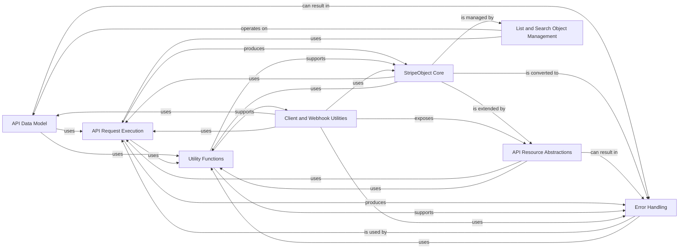

## Component Details

The Stripe Python library's core functionality revolves around representing and interacting with Stripe API resources. The `API Data Model` subsystem provides the fundamental building blocks for this interaction, defining how API responses are structured into Python objects, how their attributes are accessed and modified, and how these objects can initiate API calls to refresh their state or perform CRUD operations. This model is central to the library, enabling a consistent and intuitive way to work with Stripe data.

### API Data Model
Defines the foundational classes for representing Stripe API resources and objects. It handles object construction from API responses, attribute access, serialization/deserialization, and provides methods for refreshing object data.

**Related Classes/Methods**:

- <a href="https://github.com/stripe/stripe-python/blob/master/stripe/_stripe_object.py#L80-L612" target="_blank" rel="noopener noreferrer">`stripe._stripe_object.StripeObject` (80:612)</a>
- <a href="https://github.com/stripe/stripe-python/blob/master/stripe/_api_resource.py#L25-L232" target="_blank" rel="noopener noreferrer">`stripe._api_resource.APIResource` (25:232)</a>

### StripeObject Core
This component encapsulates the foundational `StripeObject` class, serving as the base for all Stripe API resources. It provides core functionalities for object initialization, state management, attribute access, serialization/deserialization, and basic request handling, acting as the primary data structure for API responses.

**Related Classes/Methods**:

- <a href="https://github.com/stripe/stripe-python/blob/master/stripe/_stripe_object.py#L80-L612" target="_blank" rel="noopener noreferrer">`stripe._stripe_object.StripeObject` (80:612)</a>
- <a href="https://github.com/stripe/stripe-python/blob/master/stripe/_stripe_object.py#L63-L77" target="_blank" rel="noopener noreferrer">`stripe._stripe_object:_serialize_list` (63:77)</a>
- <a href="https://github.com/stripe/stripe-python/blob/master/stripe/_stripe_object.py#L39-L41" target="_blank" rel="noopener noreferrer">`stripe._stripe_object._compute_diff` (39:41)</a>
- <a href="https://github.com/stripe/stripe-python/blob/master/stripe/_stripe_object.py#L90-L122" target="_blank" rel="noopener noreferrer">`stripe._stripe_object.StripeObject:__init__` (90:122)</a>
- <a href="https://github.com/stripe/stripe-python/blob/master/stripe/_stripe_object.py#L224-L225" target="_blank" rel="noopener noreferrer">`stripe._stripe_object.StripeObject:__setstate__` (224:225)</a>
- <a href="https://github.com/stripe/stripe-python/blob/master/stripe/_stripe_object.py#L244-L263" target="_blank" rel="noopener noreferrer">`stripe._stripe_object.StripeObject:construct_from` (244:263)</a>
- <a href="https://github.com/stripe/stripe-python/blob/master/stripe/_stripe_object.py#L266-L285" target="_blank" rel="noopener noreferrer">`stripe._stripe_object.StripeObject:_construct_from` (266:285)</a>
- <a href="https://github.com/stripe/stripe-python/blob/master/stripe/_stripe_object.py#L287-L310" target="_blank" rel="noopener noreferrer">`stripe._stripe_object.StripeObject:refresh_from` (287:310)</a>
- <a href="https://github.com/stripe/stripe-python/blob/master/stripe/_stripe_object.py#L312-L371" target="_blank" rel="noopener noreferrer">`stripe._stripe_object.StripeObject:_refresh_from` (312:371)</a>
- <a href="https://github.com/stripe/stripe-python/blob/master/stripe/_stripe_object.py#L376-L390" target="_blank" rel="noopener noreferrer">`stripe._stripe_object.StripeObject:request` (376:390)</a>
- <a href="https://github.com/stripe/stripe-python/blob/master/stripe/_stripe_object.py#L392-L413" target="_blank" rel="noopener noreferrer">`stripe._stripe_object.StripeObject:_request` (392:413)</a>
- <a href="https://github.com/stripe/stripe-python/blob/master/stripe/_stripe_object.py#L415-L436" target="_blank" rel="noopener noreferrer">`stripe._stripe_object.StripeObject:_request_async` (415:436)</a>
- <a href="https://github.com/stripe/stripe-python/blob/master/stripe/_stripe_object.py#L438-L456" target="_blank" rel="noopener noreferrer">`stripe._stripe_object.StripeObject:_request_stream` (438:456)</a>
- <a href="https://github.com/stripe/stripe-python/blob/master/stripe/_stripe_object.py#L458-L476" target="_blank" rel="noopener noreferrer">`stripe._stripe_object.StripeObject:_request_stream_async` (458:476)</a>
- <a href="https://github.com/stripe/stripe-python/blob/master/stripe/_stripe_object.py#L495-L501" target="_blank" rel="noopener noreferrer">`stripe._stripe_object.StripeObject:__str__` (495:501)</a>
- <a href="https://github.com/stripe/stripe-python/blob/master/stripe/_stripe_object.py#L509-L525" target="_blank" rel="noopener noreferrer">`stripe._stripe_object.StripeObject:_to_dict_recursive` (509:525)</a>
- <a href="https://github.com/stripe/stripe-python/blob/master/stripe/_stripe_object.py#L530-L531" target="_blank" rel="noopener noreferrer">`stripe._stripe_object.StripeObject:to_dict_recursive` (530:531)</a>
- <a href="https://github.com/stripe/stripe-python/blob/master/stripe/_stripe_object.py#L540-L561" target="_blank" rel="noopener noreferrer">`stripe._stripe_object.StripeObject:serialize` (540:561)</a>
- <a href="https://github.com/stripe/stripe-python/blob/master/stripe/_stripe_object.py#L568-L583" target="_blank" rel="noopener noreferrer">`stripe._stripe_object.StripeObject:__copy__` (568:583)</a>
- <a href="https://github.com/stripe/stripe-python/blob/master/stripe/_stripe_object.py#L590-L599" target="_blank" rel="noopener noreferrer">`stripe._stripe_object.StripeObject:__deepcopy__` (590:599)</a>
- <a href="https://github.com/stripe/stripe-python/blob/master/stripe/_stripe_object.py#L198-L212" target="_blank" rel="noopener noreferrer">`stripe._stripe_object.StripeObject.__getitem__` (198:212)</a>

### API Resource Abstractions
This component provides abstract base classes for various types of Stripe API resources, extending the `StripeObject` with common CRUD (Create, Retrieve, Update, Delete) and search functionalities. It defines the interface for interacting with specific API resources.

**Related Classes/Methods**:

- <a href="https://github.com/stripe/stripe-python/blob/master/stripe/_api_resource.py#L25-L232" target="_blank" rel="noopener noreferrer">`stripe._api_resource.APIResource` (25:232)</a>
- <a href="https://github.com/stripe/stripe-python/blob/master/stripe/_createable_api_resource.py#L8-L14" target="_blank" rel="noopener noreferrer">`stripe._createable_api_resource.CreateableAPIResource` (8:14)</a>
- <a href="https://github.com/stripe/stripe-python/blob/master/stripe/_deletable_api_resource.py#L10-L23" target="_blank" rel="noopener noreferrer">`stripe._deletable_api_resource.DeletableAPIResource` (10:23)</a>
- <a href="https://github.com/stripe/stripe-python/blob/master/stripe/_listable_api_resource.py#L12-L31" target="_blank" rel="noopener noreferrer">`stripe._listable_api_resource.ListableAPIResource` (12:31)</a>
- <a href="https://github.com/stripe/stripe-python/blob/master/stripe/_updateable_api_resource.py#L10-L31" target="_blank" rel="noopener noreferrer">`stripe._updateable_api_resource.UpdateableAPIResource` (10:31)</a>
- <a href="https://github.com/stripe/stripe-python/blob/master/stripe/_searchable_api_resource.py#L12-L49" target="_blank" rel="noopener noreferrer">`stripe._searchable_api_resource.SearchableAPIResource` (12:49)</a>
- <a href="https://github.com/stripe/stripe-python/blob/master/stripe/_singleton_api_resource.py#L11-L29" target="_blank" rel="noopener noreferrer">`stripe._singleton_api_resource.SingletonAPIResource` (11:29)</a>
- `stripe._nested_resource_class_methods` (full file reference)

### API Request Execution
This component is responsible for the low-level execution of HTTP requests to the Stripe API. It manages global API request options, constructs and sends raw HTTP requests, and interprets the raw responses into structured data or raises appropriate errors. It acts as the primary gateway for all outgoing API calls.

**Related Classes/Methods**:

- <a href="https://github.com/stripe/stripe-python/blob/master/stripe/_api_requestor.py#L69-L904" target="_blank" rel="noopener noreferrer">`stripe._api_requestor._APIRequestor` (69:904)</a>
- <a href="https://github.com/stripe/stripe-python/blob/master/stripe/_api_requestor.py#L161-L164" target="_blank" rel="noopener noreferrer">`stripe._api_requestor._APIRequestor:_global_with_options` (161:164)</a>
- <a href="https://github.com/stripe/stripe-python/blob/master/stripe/_api_requestor.py#L175-L206" target="_blank" rel="noopener noreferrer">`stripe._api_requestor._APIRequestor:request` (175:206)</a>
- <a href="https://github.com/stripe/stripe-python/blob/master/stripe/_api_requestor.py#L208-L239" target="_blank" rel="noopener noreferrer">`stripe._api_requestor._APIRequestor:request_async` (208:239)</a>
- <a href="https://github.com/stripe/stripe-python/blob/master/stripe/_api_requestor.py#L827-L856" target="_blank" rel="noopener noreferrer">`stripe._api_requestor._APIRequestor:_interpret_response` (827:856)</a>
- <a href="https://github.com/stripe/stripe-python/blob/master/stripe/_api_requestor.py#L858-L887" target="_blank" rel="noopener noreferrer">`stripe._api_requestor._APIRequestor:_interpret_streaming_response` (858:887)</a>
- <a href="https://github.com/stripe/stripe-python/blob/master/stripe/_api_requestor.py#L889-L904" target="_blank" rel="noopener noreferrer">`stripe._api_requestor._APIRequestor:_interpret_streaming_response_async` (889:904)</a>
- <a href="https://github.com/stripe/stripe-python/blob/master/stripe/_api_requestor.py#L149-L158" target="_blank" rel="noopener noreferrer">`stripe._api_requestor._APIRequestor._global_instance` (149:158)</a>
- <a href="https://github.com/stripe/stripe-python/blob/master/stripe/_api_requestor.py#L120-L130" target="_blank" rel="noopener noreferrer">`stripe._api_requestor._APIRequestor._replace_options` (120:130)</a>
- <a href="https://github.com/stripe/stripe-python/blob/master/stripe/_api_requestor.py#L665-L738" target="_blank" rel="noopener noreferrer">`stripe._api_requestor._APIRequestor.request_raw` (665:738)</a>
- <a href="https://github.com/stripe/stripe-python/blob/master/stripe/_api_requestor.py#L740-L822" target="_blank" rel="noopener noreferrer">`stripe._api_requestor._APIRequestor.request_raw_async` (740:822)</a>
- <a href="https://github.com/stripe/stripe-python/blob/master/stripe/_api_requestor.py#L824-L825" target="_blank" rel="noopener noreferrer">`stripe._api_requestor._APIRequestor._should_handle_code_as_error` (824:825)</a>
- <a href="https://github.com/stripe/stripe-python/blob/master/stripe/_api_requestor.py#L301-L336" target="_blank" rel="noopener noreferrer">`stripe._api_requestor._APIRequestor.handle_error_response` (301:336)</a>
- <a href="https://github.com/stripe/stripe-python/blob/master/stripe/_api_requestor.py#L86-L118" target="_blank" rel="noopener noreferrer">`stripe._api_requestor._APIRequestor._get_http_client` (86:118)</a>
- <a href="https://github.com/stripe/stripe-python/blob/master/stripe/_request_options.py#L54-L78" target="_blank" rel="noopener noreferrer">`stripe._request_options.extract_options_from_dict` (54:78)</a>
- <a href="https://github.com/stripe/stripe-python/blob/master/stripe/_request_options.py#L6-L14" target="_blank" rel="noopener noreferrer">`stripe._request_options.RequestOptions` (6:14)</a>
- <a href="https://github.com/stripe/stripe-python/blob/master/stripe/_requestor_options.py#L60-L91" target="_blank" rel="noopener noreferrer">`stripe._requestor_options._GlobalRequestorOptions` (60:91)</a>
- <a href="https://github.com/stripe/stripe-python/blob/master/stripe/_stripe_response.py#L31-L38" target="_blank" rel="noopener noreferrer">`stripe._stripe_response.StripeResponse` (31:38)</a>
- <a href="https://github.com/stripe/stripe-python/blob/master/stripe/_stripe_response.py#L41-L46" target="_blank" rel="noopener noreferrer">`stripe._stripe_response.StripeStreamResponse` (41:46)</a>
- <a href="https://github.com/stripe/stripe-python/blob/master/stripe/_stripe_response.py#L49-L65" target="_blank" rel="noopener noreferrer">`stripe._stripe_response.StripeStreamResponseAsync` (49:65)</a>
- <a href="https://github.com/stripe/stripe-python/blob/master/stripe/_http_client.py#L144-L590" target="_blank" rel="noopener noreferrer">`stripe._http_client.HTTPClient` (144:590)</a>
- <a href="https://github.com/stripe/stripe-python/blob/master/stripe/_http_client.py#L593-L776" target="_blank" rel="noopener noreferrer">`stripe._http_client.RequestsClient` (593:776)</a>
- <a href="https://github.com/stripe/stripe-python/blob/master/stripe/_http_client.py#L1384-L1497" target="_blank" rel="noopener noreferrer">`stripe._http_client.AIOHTTPClient` (1384:1497)</a>
- <a href="https://github.com/stripe/stripe-python/blob/master/stripe/_http_client.py#L1219-L1381" target="_blank" rel="noopener noreferrer">`stripe._http_client.HTTPXClient` (1219:1381)</a>
- <a href="https://github.com/stripe/stripe-python/blob/master/stripe/_http_client.py#L911-L1103" target="_blank" rel="noopener noreferrer">`stripe._http_client.PycurlClient` (911:1103)</a>
- <a href="https://github.com/stripe/stripe-python/blob/master/stripe/_http_client.py#L779-L903" target="_blank" rel="noopener noreferrer">`stripe._http_client.UrlFetchClient` (779:903)</a>
- <a href="https://github.com/stripe/stripe-python/blob/master/stripe/_http_client.py#L1106-L1216" target="_blank" rel="noopener noreferrer">`stripe._http_client.Urllib2Client` (1106:1216)</a>

### Utility Functions
This component provides a collection of general-purpose utility functions that support various operations across the Stripe Python library. These include functions for converting data to Stripe objects, merging dictionaries, and retrieving API mode settings, ensuring consistent data handling and configuration.

**Related Classes/Methods**:

- `stripe._util` (full file reference)
- <a href="https://github.com/stripe/stripe-python/blob/master/stripe/_util.py#L217-L226" target="_blank" rel="noopener noreferrer">`stripe._util:convert_to_stripe_object` (217:226)</a>
- <a href="https://github.com/stripe/stripe-python/blob/master/stripe/_util.py#L268-L275" target="_blank" rel="noopener noreferrer">`stripe._util._convert_to_stripe_object` (268:275)</a>
- <a href="https://github.com/stripe/stripe-python/blob/master/stripe/_util.py#L195-L198" target="_blank" rel="noopener noreferrer">`stripe._util.get_thin_event_classes` (195:198)</a>
- <a href="https://github.com/stripe/stripe-python/blob/master/stripe/_util.py#L201-L210" target="_blank" rel="noopener noreferrer">`stripe._util.get_object_classes` (201:210)</a>
- <a href="https://github.com/stripe/stripe-python/blob/master/stripe/_util.py#L409-L412" target="_blank" rel="noopener noreferrer">`stripe._util.merge_dicts` (409:412)</a>
- <a href="https://github.com/stripe/stripe-python/blob/master/stripe/_util.py#L427-L460" target="_blank" rel="noopener noreferrer">`stripe._util.class_method_variant` (427:460)</a>
- <a href="https://github.com/stripe/stripe-python/blob/master/stripe/_util.py#L420-L424" target="_blank" rel="noopener noreferrer">`stripe._util.get_api_mode` (420:424)</a>
- `stripe._object_classes` (full file reference)
- `stripe.events._event_classes` (full file reference)

### Error Handling
This component defines the structure and behavior of various error types encountered during interactions with the Stripe API. It includes classes for general Stripe errors, invalid requests, and API-specific errors, as well as mechanisms for constructing error objects from API responses, providing robust error reporting.

**Related Classes/Methods**:

- <a href="https://github.com/stripe/stripe-python/blob/master/stripe/_error.py#L7-L92" target="_blank" rel="noopener noreferrer">`stripe._error.StripeError` (7:92)</a>
- <a href="https://github.com/stripe/stripe-python/blob/master/stripe/_error.py#L76-L92" target="_blank" rel="noopener noreferrer">`stripe._error.StripeError:_construct_error_object` (76:92)</a>
- <a href="https://github.com/stripe/stripe-python/blob/master/stripe/_error.py#L99-L115" target="_blank" rel="noopener noreferrer">`stripe._error.APIConnectionError` (99:115)</a>
- <a href="https://github.com/stripe/stripe-python/blob/master/stripe/_error.py#L95-L96" target="_blank" rel="noopener noreferrer">`stripe._error.APIError` (95:96)</a>
- <a href="https://github.com/stripe/stripe-python/blob/master/stripe/_error.py#L172-L173" target="_blank" rel="noopener noreferrer">`stripe._error.AuthenticationError` (172:173)</a>
- <a href="https://github.com/stripe/stripe-python/blob/master/stripe/_error.py#L134-L148" target="_blank" rel="noopener noreferrer">`stripe._error.CardError` (134:148)</a>
- <a href="https://github.com/stripe/stripe-python/blob/master/stripe/_error.py#L151-L152" target="_blank" rel="noopener noreferrer">`stripe._error.IdempotencyError` (151:152)</a>
- <a href="https://github.com/stripe/stripe-python/blob/master/stripe/_error.py#L155-L169" target="_blank" rel="noopener noreferrer">`stripe._error.InvalidRequestError` (155:169)</a>
- <a href="https://github.com/stripe/stripe-python/blob/master/stripe/_error.py#L176-L177" target="_blank" rel="noopener noreferrer">`stripe._error.PermissionError` (176:177)</a>
- <a href="https://github.com/stripe/stripe-python/blob/master/stripe/_error.py#L180-L181" target="_blank" rel="noopener noreferrer">`stripe._error.RateLimitError` (180:181)</a>
- <a href="https://github.com/stripe/stripe-python/blob/master/stripe/_error.py#L184-L187" target="_blank" rel="noopener noreferrer">`stripe._error.SignatureVerificationError` (184:187)</a>
- <a href="https://github.com/stripe/stripe-python/blob/master/stripe/_error.py#L118-L131" target="_blank" rel="noopener noreferrer">`stripe._error.StripeErrorWithParamCode` (118:131)</a>
- <a href="https://github.com/stripe/stripe-python/blob/master/stripe/_error.py#L191-L192" target="_blank" rel="noopener noreferrer">`stripe._error.TemporarySessionExpiredError` (191:192)</a>
- <a href="https://github.com/stripe/stripe-python/blob/master/stripe/_error_object.py#L14-L86" target="_blank" rel="noopener noreferrer">`stripe._error_object.ErrorObject` (14:86)</a>
- <a href="https://github.com/stripe/stripe-python/blob/master/stripe/_error_object.py#L27-L50" target="_blank" rel="noopener noreferrer">`stripe._error_object.ErrorObject:refresh_from` (27:50)</a>
- <a href="https://github.com/stripe/stripe-python/blob/master/stripe/_error_object.py#L52-L86" target="_blank" rel="noopener noreferrer">`stripe._error_object.ErrorObject:_refresh_from` (52:86)</a>
- <a href="https://github.com/stripe/stripe-python/blob/master/stripe/_error_object.py#L89-L136" target="_blank" rel="noopener noreferrer">`stripe._error_object.OAuthErrorObject` (89:136)</a>
- <a href="https://github.com/stripe/stripe-python/blob/master/stripe/_error_object.py#L90-L113" target="_blank" rel="noopener noreferrer">`stripe._error_object.OAuthErrorObject:refresh_from` (90:113)</a>
- <a href="https://github.com/stripe/stripe-python/blob/master/stripe/_error_object.py#L115-L136" target="_blank" rel="noopener noreferrer">`stripe._error_object.OAuthErrorObject:_refresh_from` (115:136)</a>
- <a href="https://github.com/stripe/stripe-python/blob/master/stripe/oauth_error.py#L6-L28" target="_blank" rel="noopener noreferrer">`stripe.oauth_error.OAuthError` (6:28)</a>
- <a href="https://github.com/stripe/stripe-python/blob/master/stripe/oauth_error.py#L31-L32" target="_blank" rel="noopener noreferrer">`stripe.oauth_error.InvalidClientError` (31:32)</a>
- <a href="https://github.com/stripe/stripe-python/blob/master/stripe/oauth_error.py#L35-L36" target="_blank" rel="noopener noreferrer">`stripe.oauth_error.InvalidGrantError` (35:36)</a>
- <a href="https://github.com/stripe/stripe-python/blob/master/stripe/oauth_error.py#L39-L40" target="_blank" rel="noopener noreferrer">`stripe.oauth_error.InvalidRequestError` (39:40)</a>
- <a href="https://github.com/stripe/stripe-python/blob/master/stripe/oauth_error.py#L43-L44" target="_blank" rel="noopener noreferrer">`stripe.oauth_error.InvalidScopeError` (43:44)</a>
- <a href="https://github.com/stripe/stripe-python/blob/master/stripe/oauth_error.py#L47-L48" target="_blank" rel="noopener noreferrer">`stripe.oauth_error.UnsupportedGrantTypeError` (47:48)</a>
- <a href="https://github.com/stripe/stripe-python/blob/master/stripe/oauth_error.py#L51-L52" target="_blank" rel="noopener noreferrer">`stripe.oauth_error.UnsupportedResponseTypeError` (51:52)</a>

### List and Search Object Management
This component specializes in handling paginated list and search results from the Stripe API. It provides methods for listing, creating, retrieving, and iterating through collections of resources, including automatic pagination, and manages the logic for navigating through result pages.

**Related Classes/Methods**:

- <a href="https://github.com/stripe/stripe-python/blob/master/stripe/_list_object.py#L29-L257" target="_blank" rel="noopener noreferrer">`stripe._list_object.ListObject` (29:257)</a>
- <a href="https://github.com/stripe/stripe-python/blob/master/stripe/_list_object.py#L43-L52" target="_blank" rel="noopener noreferrer">`stripe._list_object.ListObject:list` (43:52)</a>
- <a href="https://github.com/stripe/stripe-python/blob/master/stripe/_list_object.py#L54-L63" target="_blank" rel="noopener noreferrer">`stripe._list_object.ListObject:list_async` (54:63)</a>
- <a href="https://github.com/stripe/stripe-python/blob/master/stripe/_list_object.py#L65-L79" target="_blank" rel="noopener noreferrer">`stripe._list_object.ListObject:create` (65:79)</a>
- <a href="https://github.com/stripe/stripe-python/blob/master/stripe/_list_object.py#L81-L97" target="_blank" rel="noopener noreferrer">`stripe._list_object.ListObject:retrieve` (81:97)</a>
- <a href="https://github.com/stripe/stripe-python/blob/master/stripe/_list_object.py#L99-L108" target="_blank" rel="noopener noreferrer">`stripe._list_object.ListObject:__getitem__` (99:108)</a>
- <a href="https://github.com/stripe/stripe-python/blob/master/stripe/_list_object.py#L124-L128" target="_blank" rel="noopener noreferrer">`stripe._list_object.ListObject:auto_paging_iter` (124:128)</a>
- <a href="https://github.com/stripe/stripe-python/blob/master/stripe/_list_object.py#L169-L180" target="_blank" rel="noopener noreferrer">`stripe._list_object.ListObject:_empty_list` (169:180)</a>
- <a href="https://github.com/stripe/stripe-python/blob/master/stripe/_list_object.py#L200-L208" target="_blank" rel="noopener noreferrer">`stripe._list_object.ListObject:next_page` (200:208)</a>
- <a href="https://github.com/stripe/stripe-python/blob/master/stripe/_list_object.py#L210-L217" target="_blank" rel="noopener noreferrer">`stripe._list_object.ListObject:next_page_async` (210:217)</a>
- <a href="https://github.com/stripe/stripe-python/blob/master/stripe/_list_object.py#L233-L243" target="_blank" rel="noopener noreferrer">`stripe._list_object.ListObject:previous_page` (233:243)</a>
- <a href="https://github.com/stripe/stripe-python/blob/master/stripe/_list_object.py#L245-L257" target="_blank" rel="noopener noreferrer">`stripe._list_object.ListObject:previous_page_async` (245:257)</a>
- <a href="https://github.com/stripe/stripe-python/blob/master/stripe/_list_object.py#L35-L41" target="_blank" rel="noopener noreferrer">`stripe._list_object.ListObject._get_url_for_list` (35:41)</a>
- <a href="https://github.com/stripe/stripe-python/blob/master/stripe/_list_object.py#L186-L198" target="_blank" rel="noopener noreferrer">`stripe._list_object.ListObject._get_filters_for_next_page` (186:198)</a>
- <a href="https://github.com/stripe/stripe-python/blob/master/stripe/_list_object.py#L219-L231" target="_blank" rel="noopener noreferrer">`stripe._list_object.ListObject._get_filters_for_previous_page` (219:231)</a>
- <a href="https://github.com/stripe/stripe-python/blob/master/stripe/_search_result_object.py#L27-L178" target="_blank" rel="noopener noreferrer">`stripe._search_result_object.SearchResultObject` (27:178)</a>
- <a href="https://github.com/stripe/stripe-python/blob/master/stripe/_search_result_object.py#L33-L38" target="_blank" rel="noopener noreferrer">`stripe._search_result_object.SearchResultObject:_search` (33:38)</a>
- <a href="https://github.com/stripe/stripe-python/blob/master/stripe/_search_result_object.py#L51-L60" target="_blank" rel="noopener noreferrer">`stripe._search_result_object.SearchResultObject:search` (51:60)</a>
- <a href="https://github.com/stripe/stripe-python/blob/master/stripe/_search_result_object.py#L62-L71" target="_blank" rel="noopener noreferrer">`stripe._search_result_object.SearchResultObject:_search_async` (62:71)</a>
- <a href="https://github.com/stripe/stripe-python/blob/master/stripe/_search_result_object.py#L73-L82" target="_blank" rel="noopener noreferrer">`stripe._search_result_object.SearchResultObject:__getitem__` (73:82)</a>
- <a href="https://github.com/stripe/stripe-python/blob/master/stripe/_search_result_object.py#L93-L102" target="_blank" rel="noopener noreferrer">`stripe._search_result_object.SearchResultObject:_auto_paging_iter` (93:102)</a>
- <a href="https://github.com/stripe/stripe-python/blob/master/stripe/_search_result_object.py#L104-L107" target="_blank" rel="noopener noreferrer">`stripe._search_result_object.SearchResultObject:auto_paging_iter` (104:107)</a>
- <a href="https://github.com/stripe/stripe-python/blob/master/stripe/_search_result_object.py#L109-L118" target="_blank" rel="noopener noreferrer">`stripe._search_result_object.SearchResultObject:_auto_paging_iter_async` (109:118)</a>
- <a href="https://github.com/stripe/stripe-python/blob/master/stripe/_search_result_object.py#L121-L132" target="_blank" rel="noopener noreferrer">`stripe._search_result_object.SearchResultObject:_empty_search_result` (121:132)</a>
- <a href="https://github.com/stripe/stripe-python/blob/master/stripe/_search_result_object.py#L146-L154" target="_blank" rel="noopener noreferrer">`stripe._search_result_object.SearchResultObject:_maybe_empty_result` (146:154)</a>
- <a href="https://github.com/stripe/stripe-python/blob/master/stripe/_search_result_object.py#L156-L166" target="_blank" rel="noopener noreferrer">`stripe._search_result_object.SearchResultObject:next_search_result_page` (156:166)</a>
- <a href="https://github.com/stripe/stripe-python/blob/master/stripe/_search_result_object.py#L168-L178" target="_blank" rel="noopener noreferrer">`stripe._search_result_object.SearchResultObject:next_search_result_page_async` (168:178)</a>
- <a href="https://github.com/stripe/stripe-python/blob/master/stripe/_search_result_object.py#L40-L46" target="_blank" rel="noopener noreferrer">`stripe._search_result_object.SearchResultObject._get_url_for_search` (40:46)</a>
- <a href="https://github.com/stripe/stripe-python/blob/master/stripe/_search_result_object.py#L138-L144" target="_blank" rel="noopener noreferrer">`stripe._search_result_object.SearchResultObject._get_filters_for_next_page` (138:144)</a>
- <a href="https://github.com/stripe/stripe-python/blob/master/stripe/v2/_list_object.py#L8-L59" target="_blank" rel="noopener noreferrer">`stripe.v2._list_object.ListObject` (8:59)</a>
- <a href="https://github.com/stripe/stripe-python/blob/master/stripe/v2/_list_object.py#L43-L59" target="_blank" rel="noopener noreferrer">`stripe.v2._list_object.ListObject:auto_paging_iter` (43:59)</a>
- <a href="https://github.com/stripe/stripe-python/blob/master/stripe/_any_iterator.py#L6-L34" target="_blank" rel="noopener noreferrer">`stripe._any_iterator.AnyIterator` (6:34)</a>

### Client and Webhook Utilities
This component provides specialized functionalities for handling webhooks and the main Stripe client. It includes methods for constructing event objects from webhook payloads, verifying webhook signatures for security, and deserializing API responses into appropriate Stripe objects, serving as an interface for event processing and client-side operations.

**Related Classes/Methods**:

- <a href="https://github.com/stripe/stripe-python/blob/master/stripe/_webhook.py#L15-L36" target="_blank" rel="noopener noreferrer">`stripe._webhook.Webhook` (15:36)</a>
- <a href="https://github.com/stripe/stripe-python/blob/master/stripe/_webhook.py#L19-L36" target="_blank" rel="noopener noreferrer">`stripe._webhook.Webhook:construct_event` (19:36)</a>
- <a href="https://github.com/stripe/stripe-python/blob/master/stripe/_webhook.py#L59-L96" target="_blank" rel="noopener noreferrer">`stripe._webhook.WebhookSignature.verify_header` (59:96)</a>
- <a href="https://github.com/stripe/stripe-python/blob/master/stripe/_stripe_client.py#L115-L372" target="_blank" rel="noopener noreferrer">`stripe._stripe_client.StripeClient` (115:372)</a>
- <a href="https://github.com/stripe/stripe-python/blob/master/stripe/_stripe_client.py#L288-L307" target="_blank" rel="noopener noreferrer">`stripe._stripe_client.StripeClient:construct_event` (288:307)</a>
- <a href="https://github.com/stripe/stripe-python/blob/master/stripe/_stripe_client.py#L360-L372" target="_blank" rel="noopener noreferrer">`stripe._stripe_client.StripeClient:deserialize` (360:372)</a>
- <a href="https://github.com/stripe/stripe-python/blob/master/stripe/_stripe_service.py#L15-L91" target="_blank" rel="noopener noreferrer">`stripe._stripe_service.StripeService` (15:91)</a>
- <a href="https://github.com/stripe/stripe-python/blob/master/stripe/_client_options.py#L4-L17" target="_blank" rel="noopener noreferrer">`stripe._client_options._ClientOptions` (4:17)</a>

### [FAQ](https://github.com/CodeBoarding/GeneratedOnBoardings/tree/main?tab=readme-ov-file#faq)