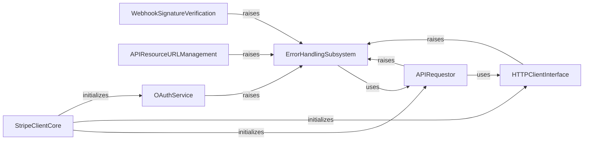

## Component Details

This graph illustrates the core components involved in handling errors within the Stripe Python client library. The central purpose is to provide a robust and structured mechanism for identifying, categorizing, and presenting various API-related errors to the user, ensuring that developers can gracefully handle issues like network problems, invalid requests, or authentication failures. The flow generally starts with the `APIRequestor` or `HTTPClientInterface` encountering an issue, which then propagates to the `ErrorHandlingSubsystem` to construct and raise appropriate `StripeError` subclasses. Other components like `WebhookSignatureVerification` and `OAuthService` also raise errors that are part of this subsystem.

### ErrorHandlingSubsystem
This subsystem is responsible for defining, constructing, and managing all types of errors that can occur during interactions with the Stripe API, including general API errors, connection errors, card errors, and specific OAuth-related errors. It provides a hierarchical structure for exceptions and mechanisms to create detailed error objects from API responses.

**Related Classes/Methods**:

- <a href="https://github.com/stripe/stripe-python/blob/master/stripe/_error.py#L7-L92" target="_blank" rel="noopener noreferrer">`stripe._error.StripeError` (7:92)</a>
- <a href="https://github.com/stripe/stripe-python/blob/master/stripe/_error.py#L95-L96" target="_blank" rel="noopener noreferrer">`stripe._error.APIError` (95:96)</a>
- <a href="https://github.com/stripe/stripe-python/blob/master/stripe/_error.py#L99-L115" target="_blank" rel="noopener noreferrer">`stripe._error.APIConnectionError` (99:115)</a>
- <a href="https://github.com/stripe/stripe-python/blob/master/stripe/_error.py#L134-L148" target="_blank" rel="noopener noreferrer">`stripe._error.CardError` (134:148)</a>
- <a href="https://github.com/stripe/stripe-python/blob/master/stripe/_error.py#L155-L169" target="_blank" rel="noopener noreferrer">`stripe._error.InvalidRequestError` (155:169)</a>
- <a href="https://github.com/stripe/stripe-python/blob/master/stripe/_error.py#L172-L173" target="_blank" rel="noopener noreferrer">`stripe._error.AuthenticationError` (172:173)</a>
- <a href="https://github.com/stripe/stripe-python/blob/master/stripe/_error.py#L184-L187" target="_blank" rel="noopener noreferrer">`stripe._error.SignatureVerificationError` (184:187)</a>
- <a href="https://github.com/stripe/stripe-python/blob/master/stripe/oauth_error.py#L6-L28" target="_blank" rel="noopener noreferrer">`stripe.oauth_error.OAuthError` (6:28)</a>
- <a href="https://github.com/stripe/stripe-python/blob/master/stripe/_error.py#L151-L152" target="_blank" rel="noopener noreferrer">`stripe._error.IdempotencyError` (151:152)</a>
- <a href="https://github.com/stripe/stripe-python/blob/master/stripe/_error.py#L176-L177" target="_blank" rel="noopener noreferrer">`stripe._error.PermissionError` (176:177)</a>
- <a href="https://github.com/stripe/stripe-python/blob/master/stripe/_error.py#L180-L181" target="_blank" rel="noopener noreferrer">`stripe._error.RateLimitError` (180:181)</a>
- <a href="https://github.com/stripe/stripe-python/blob/master/stripe/_error.py#L191-L192" target="_blank" rel="noopener noreferrer">`stripe._error.TemporarySessionExpiredError` (191:192)</a>
- <a href="https://github.com/stripe/stripe-python/blob/master/stripe/_error_object.py#L14-L86" target="_blank" rel="noopener noreferrer">`stripe._error_object.ErrorObject` (14:86)</a>
- <a href="https://github.com/stripe/stripe-python/blob/master/stripe/_error_object.py#L89-L136" target="_blank" rel="noopener noreferrer">`stripe._error_object.OAuthErrorObject` (89:136)</a>

### APIRequestor
This component is the core mechanism for sending requests to the Stripe API. It handles request preparation (headers, parameters, encoding), retries, and the initial interpretation of raw HTTP responses, delegating error handling to the Error Handling Subsystem.

**Related Classes/Methods**:

- <a href="https://github.com/stripe/stripe-python/blob/master/stripe/_api_requestor.py#L69-L904" target="_blank" rel="noopener noreferrer">`stripe-python.stripe._api_requestor._APIRequestor` (69:904)</a>
- <a href="https://github.com/stripe/stripe-python/blob/master/stripe/_api_requestor.py#L301-L336" target="_blank" rel="noopener noreferrer">`stripe-python.stripe._api_requestor._APIRequestor:handle_error_response` (301:336)</a>
- <a href="https://github.com/stripe/stripe-python/blob/master/stripe/_api_requestor.py#L338-L375" target="_blank" rel="noopener noreferrer">`stripe-python.stripe._api_requestor._APIRequestor:specific_v2_api_error` (338:375)</a>
- <a href="https://github.com/stripe/stripe-python/blob/master/stripe/_api_requestor.py#L377-L429" target="_blank" rel="noopener noreferrer">`stripe-python.stripe._api_requestor._APIRequestor:specific_v1_api_error` (377:429)</a>
- <a href="https://github.com/stripe/stripe-python/blob/master/stripe/_api_requestor.py#L431-L455" target="_blank" rel="noopener noreferrer">`stripe-python.stripe._api_requestor._APIRequestor:specific_oauth_error` (431:455)</a>

### HTTPClientInterface
This component provides an abstraction layer for various underlying HTTP client libraries (e.g., Requests, Urllib2, HTTPX, AIOHTTP). It's responsible for executing the actual network calls and handling low-level connection errors, which are then propagated to the Error Handling Subsystem.

**Related Classes/Methods**:

- <a href="https://github.com/stripe/stripe-python/blob/master/stripe/_http_client.py#L721-L772" target="_blank" rel="noopener noreferrer">`stripe-python.stripe._http_client.RequestsClient:_handle_request_error` (721:772)</a>
- <a href="https://github.com/stripe/stripe-python/blob/master/stripe/_http_client.py#L877-L900" target="_blank" rel="noopener noreferrer">`stripe-python.stripe._http_client.UrlFetchClient:_handle_request_error` (877:900)</a>
- <a href="https://github.com/stripe/stripe-python/blob/master/stripe/_http_client.py#L1059-L1092" target="_blank" rel="noopener noreferrer">`stripe-python.stripe._http_client.PycurlClient:_handle_request_error` (1059:1092)</a>
- <a href="https://github.com/stripe/stripe-python/blob/master/stripe/_http_client.py#L1207-L1213" target="_blank" rel="noopener noreferrer">`stripe-python.stripe._http_client.Urllib2Client:_handle_request_error` (1207:1213)</a>
- <a href="https://github.com/stripe/stripe-python/blob/master/stripe/_http_client.py#L1322-L1331" target="_blank" rel="noopener noreferrer">`stripe-python.stripe._http_client.HTTPXClient:_handle_request_error` (1322:1331)</a>
- <a href="https://github.com/stripe/stripe-python/blob/master/stripe/_http_client.py#L1461-L1470" target="_blank" rel="noopener noreferrer">`stripe-python.stripe._http_client.AIOHTTPClient:_handle_request_error` (1461:1470)</a>

### StripeClientCore
This is the main entry point for interacting with the Stripe API. It initializes the API requestor and all the various service objects (e.g., for customers, payments, subscriptions), providing a structured interface for developers to access Stripe functionalities.

**Related Classes/Methods**:

- <a href="https://github.com/stripe/stripe-python/blob/master/stripe/_stripe_client.py#L116-L268" target="_blank" rel="noopener noreferrer">`stripe-python.stripe._stripe_client.StripeClient:__init__` (116:268)</a>

### WebhookSignatureVerification
This component is dedicated to verifying the authenticity and integrity of incoming webhook events from Stripe by validating their signatures against a shared secret. It plays a crucial role in securing webhook endpoints.

**Related Classes/Methods**:

- <a href="https://github.com/stripe/stripe-python/blob/master/stripe/_webhook.py#L39-L96" target="_blank" rel="noopener noreferrer">`stripe-python.stripe._webhook.WebhookSignature` (39:96)</a>
- <a href="https://github.com/stripe/stripe-python/blob/master/stripe/_webhook.py#L59-L96" target="_blank" rel="noopener noreferrer">`stripe-python.stripe._webhook.WebhookSignature:verify_header` (59:96)</a>

### APIResourceURLManagement
This component is responsible for dynamically generating and validating URLs for various Stripe API resources (e.g., Bank Accounts, Cards). It ensures that API requests are directed to the correct endpoints and handles cases of invalid resource IDs.

**Related Classes/Methods**:

- <a href="https://github.com/stripe/stripe-python/blob/master/stripe/_api_resource.py#L57-L70" target="_blank" rel="noopener noreferrer">`stripe-python.stripe._api_resource.APIResource:instance_url` (57:70)</a>
- <a href="https://github.com/stripe/stripe-python/blob/master/stripe/_api_resource.py#L46-L55" target="_blank" rel="noopener noreferrer">`stripe-python.stripe._api_resource.APIResource.class_url` (46:55)</a>
- <a href="https://github.com/stripe/stripe-python/blob/master/stripe/_bank_account.py#L479-L509" target="_blank" rel="noopener noreferrer">`stripe-python.stripe._bank_account.BankAccount:instance_url` (479:509)</a>
- <a href="https://github.com/stripe/stripe-python/blob/master/stripe/_card.py#L274-L305" target="_blank" rel="noopener noreferrer">`stripe-python.stripe._card.Card:instance_url` (274:305)</a>

### OAuthService
This component provides specific functionalities related to Stripe OAuth, primarily focused on managing and setting the client ID for OAuth flows.

**Related Classes/Methods**:

- <a href="https://github.com/stripe/stripe-python/blob/master/stripe/_oauth_service.py#L27-L45" target="_blank" rel="noopener noreferrer">`stripe-python.stripe._oauth_service.OAuthService:_set_client_id` (27:45)</a>
- <a href="https://github.com/stripe/stripe-python/blob/master/stripe/_oauth.py#L286-L304" target="_blank" rel="noopener noreferrer">`stripe-python.stripe._oauth.OAuth:_set_client_id` (286:304)</a>

### [FAQ](https://github.com/CodeBoarding/GeneratedOnBoardings/tree/main?tab=readme-ov-file#faq)