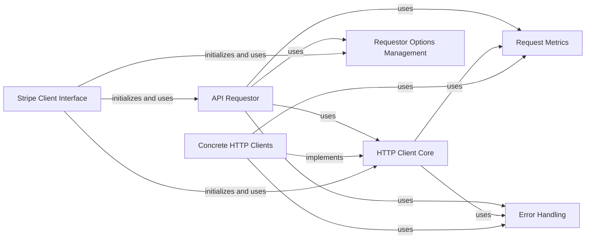

## Component Details

This graph illustrates the architecture of the API Request & Transport subsystem within the Stripe client library. The core functionality revolves around the `API Requestor` which orchestrates the entire API call lifecycle, from constructing requests to handling responses and errors. It delegates the actual network communication to various `Concrete HTTP Clients` that adhere to the `HTTP Client Core` interface. Configuration and metrics are managed by `Requestor Options Management` and `Request Metrics` respectively, while `Error Handling` ensures robust error propagation. The `Stripe Client Interface` serves as the primary entry point for users, initializing and coordinating these underlying components.

### API Requestor
Orchestrates the entire API request lifecycle. It constructs request headers, handles retries, delegates to the HTTP Client for network communication, interprets raw responses, and manages error propagation. It also incorporates requestor-specific options.

**Related Classes/Methods**:

- <a href="https://github.com/stripe/stripe-python/blob/master/stripe/_api_requestor.py#L69-L904" target="_blank" rel="noopener noreferrer">`stripe._api_requestor._APIRequestor` (69:904)</a>

### HTTP Client Core
Provides the abstract interface and common functionalities for HTTP communication, including request retries, sleep time calculations, and telemetry header addition. Concrete HTTP clients implement this interface.

**Related Classes/Methods**:

- <a href="https://github.com/stripe/stripe-python/blob/master/stripe/_http_client.py#L144-L590" target="_blank" rel="noopener noreferrer">`stripe._http_client.HTTPClient` (144:590)</a>
- <a href="https://github.com/stripe/stripe-python/blob/master/stripe/_http_client.py#L116-L117" target="_blank" rel="noopener noreferrer">`stripe._http_client._now_ms` (116:117)</a>
- <a href="https://github.com/stripe/stripe-python/blob/master/stripe/_http_client.py#L120-L130" target="_blank" rel="noopener noreferrer">`stripe._http_client.new_default_http_client` (120:130)</a>
- <a href="https://github.com/stripe/stripe-python/blob/master/stripe/_http_client.py#L133-L141" target="_blank" rel="noopener noreferrer">`stripe._http_client.new_http_client_async_fallback` (133:141)</a>

### Concrete HTTP Clients
Specific implementations of the `HTTPClient` interface, each utilizing a different underlying HTTP library (e.g., Requests, HTTPX, AIOHTTP). These clients are responsible for the actual low-level network communication.

**Related Classes/Methods**:

- <a href="https://github.com/stripe/stripe-python/blob/master/stripe/_http_client.py#L593-L776" target="_blank" rel="noopener noreferrer">`stripe._http_client.RequestsClient` (593:776)</a>
- <a href="https://github.com/stripe/stripe-python/blob/master/stripe/_http_client.py#L779-L903" target="_blank" rel="noopener noreferrer">`stripe._http_client.UrlFetchClient` (779:903)</a>
- <a href="https://github.com/stripe/stripe-python/blob/master/stripe/_http_client.py#L911-L1103" target="_blank" rel="noopener noreferrer">`stripe._http_client.PycurlClient` (911:1103)</a>
- <a href="https://github.com/stripe/stripe-python/blob/master/stripe/_http_client.py#L1106-L1216" target="_blank" rel="noopener noreferrer">`stripe._http_client.Urllib2Client` (1106:1216)</a>
- <a href="https://github.com/stripe/stripe-python/blob/master/stripe/_http_client.py#L1219-L1381" target="_blank" rel="noopener noreferrer">`stripe._http_client.HTTPXClient` (1219:1381)</a>
- <a href="https://github.com/stripe/stripe-python/blob/master/stripe/_http_client.py#L1384-L1497" target="_blank" rel="noopener noreferrer">`stripe._http_client.AIOHTTPClient` (1384:1497)</a>
- <a href="https://github.com/stripe/stripe-python/blob/master/stripe/_http_client.py#L1500-L1526" target="_blank" rel="noopener noreferrer">`stripe._http_client.NoImportFoundAsyncClient` (1500:1526)</a>

### Requestor Options Management
Manages global and per-request configuration options for API requests, such as API keys, version, and timeout settings.

**Related Classes/Methods**:

- <a href="https://github.com/stripe/stripe-python/blob/master/stripe/_requestor_options.py#L8-L57" target="_blank" rel="noopener noreferrer">`stripe._requestor_options.RequestorOptions` (8:57)</a>
- <a href="https://github.com/stripe/stripe-python/blob/master/stripe/_requestor_options.py#L60-L91" target="_blank" rel="noopener noreferrer">`stripe._requestor_options._GlobalRequestorOptions` (60:91)</a>

### Request Metrics
Provides functionality for collecting and reporting metrics related to API requests, such as request duration and retry attempts.

**Related Classes/Methods**:

- <a href="https://github.com/stripe/stripe-python/blob/master/stripe/_request_metrics.py#L4-L23" target="_blank" rel="noopener noreferrer">`stripe._request_metrics.RequestMetrics` (4:23)</a>

### Error Handling
Defines and manages various types of API-related errors (e.g., connection errors, authentication errors, invalid requests) and provides mechanisms for their propagation and handling.

**Related Classes/Methods**:

- <a href="https://github.com/stripe/stripe-python/blob/master/stripe/_error.py#L99-L115" target="_blank" rel="noopener noreferrer">`stripe._error.APIConnectionError` (99:115)</a>
- <a href="https://github.com/stripe/stripe-python/blob/master/stripe/_error.py#L95-L96" target="_blank" rel="noopener noreferrer">`stripe._error.APIError` (95:96)</a>
- <a href="https://github.com/stripe/stripe-python/blob/master/stripe/_error.py#L172-L173" target="_blank" rel="noopener noreferrer">`stripe._error.AuthenticationError` (172:173)</a>
- <a href="https://github.com/stripe/stripe-python/blob/master/stripe/_error.py#L134-L148" target="_blank" rel="noopener noreferrer">`stripe._error.CardError` (134:148)</a>
- <a href="https://github.com/stripe/stripe-python/blob/master/stripe/_error.py#L151-L152" target="_blank" rel="noopener noreferrer">`stripe._error.IdempotencyError` (151:152)</a>
- <a href="https://github.com/stripe/stripe-python/blob/master/stripe/_error.py#L155-L169" target="_blank" rel="noopener noreferrer">`stripe._error.InvalidRequestError` (155:169)</a>
- <a href="https://github.com/stripe/stripe-python/blob/master/stripe/_error.py#L176-L177" target="_blank" rel="noopener noreferrer">`stripe._error.PermissionError` (176:177)</a>
- <a href="https://github.com/stripe/stripe-python/blob/master/stripe/_error.py#L180-L181" target="_blank" rel="noopener noreferrer">`stripe._error.RateLimitError` (180:181)</a>
- <a href="https://github.com/stripe/stripe-python/blob/master/stripe/_error.py#L184-L187" target="_blank" rel="noopener noreferrer">`stripe._error.SignatureVerificationError` (184:187)</a>
- <a href="https://github.com/stripe/stripe-python/blob/master/stripe/_error.py#L118-L131" target="_blank" rel="noopener noreferrer">`stripe._error.StripeErrorWithParamCode` (118:131)</a>
- <a href="https://github.com/stripe/stripe-python/blob/master/stripe/_error.py#L191-L192" target="_blank" rel="noopener noreferrer">`stripe._error.TemporarySessionExpiredError` (191:192)</a>
- <a href="https://github.com/stripe/stripe-python/blob/master/stripe/_error_object.py#L14-L86" target="_blank" rel="noopener noreferrer">`stripe._error_object.ErrorObject` (14:86)</a>
- <a href="https://github.com/stripe/stripe-python/blob/master/stripe/oauth_error.py#L6-L28" target="_blank" rel="noopener noreferrer">`stripe.oauth_error.OAuthError` (6:28)</a>

### Stripe Client Interface
The top-level entry point for users to interact with the Stripe API. It initializes and orchestrates the `API Requestor` and `HTTP Client Core` components, providing a simplified interface for making API calls.

**Related Classes/Methods**:

- <a href="https://github.com/stripe/stripe-python/blob/master/stripe/_stripe_client.py#L115-L372" target="_blank" rel="noopener noreferrer">`stripe._stripe_client.StripeClient` (115:372)</a>

### [FAQ](https://github.com/CodeBoarding/GeneratedOnBoardings/tree/main?tab=readme-ov-file#faq)