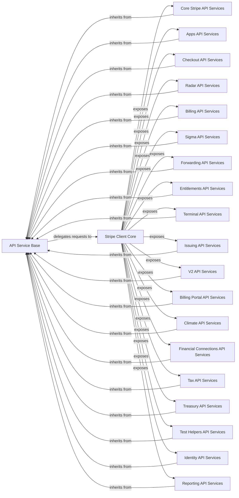

## Component Details

This graph illustrates the architecture of the Stripe API client library, focusing on how various API services are structured and interact with the core client. The `API Service Base` provides a common foundation for all specific Stripe API services, handling the underlying request mechanisms by delegating to the `Stripe Client Core`. The `Stripe Client Core` acts as the central interface for all API interactions, exposing a wide array of specialized API services (e.g., Core Stripe, Apps, Checkout, Billing, etc.) that inherit common functionalities from the `API Service Base`. This design promotes modularity and reusability, allowing for consistent API request handling across different Stripe functionalities.

### API Service Base
A foundational class providing common methods for making API requests (e.g., _request, _request_async, _request_stream, _request_stream_async) by delegating to the API Request & Transport mechanism.

**Related Classes/Methods**:

- <a href="https://github.com/stripe/stripe-python/blob/master/stripe/_stripe_service.py#L15-L91" target="_blank" rel="noopener noreferrer">`stripe._stripe_service.StripeService` (15:91)</a>

### Stripe Client Core
Provides the fundamental client interface for interacting with the Stripe API, including the core request execution logic for synchronous and asynchronous operations. This component is responsible for sending all API requests to the Stripe backend and orchestrating the use of various API services.

**Related Classes/Methods**:

- <a href="https://github.com/stripe/stripe-python/blob/master/stripe/_stripe_client.py#L115-L372" target="_blank" rel="noopener noreferrer">`stripe._stripe_client.StripeClient` (115:372)</a>

### Core Stripe API Services
A comprehensive collection of services providing interfaces for the most common and widely used Stripe API resources, such as mandates, customer payment methods, invoices, products, promotions, accounts, payments, subscriptions, and more. This component acts as the primary interface for general Stripe operations.

**Related Classes/Methods**:

- <a href="https://github.com/stripe/stripe-python/blob/master/stripe/_mandate_service.py#L11-L56" target="_blank" rel="noopener noreferrer">`stripe._mandate_service.MandateService` (11:56)</a>
- <a href="https://github.com/stripe/stripe-python/blob/master/stripe/_customer_payment_method_service.py#L12-L187" target="_blank" rel="noopener noreferrer">`stripe._customer_payment_method_service.CustomerPaymentMethodService` (12:187)</a>
- <a href="https://github.com/stripe/stripe-python/blob/master/stripe/_invoice_line_item_service.py#L12-L362" target="_blank" rel="noopener noreferrer">`stripe._invoice_line_item_service.InvoiceLineItemService` (12:362)</a>
- <a href="https://github.com/stripe/stripe-python/blob/master/stripe/_promotion_code_service.py#L12-L345" target="_blank" rel="noopener noreferrer">`stripe._promotion_code_service.PromotionCodeService` (12:345)</a>
- <a href="https://github.com/stripe/stripe-python/blob/master/stripe/_invoice_item_service.py#L12-L528" target="_blank" rel="noopener noreferrer">`stripe._invoice_item_service.InvoiceItemService` (12:528)</a>
- <a href="https://github.com/stripe/stripe-python/blob/master/stripe/_apple_pay_domain_service.py#L12-L210" target="_blank" rel="noopener noreferrer">`stripe._apple_pay_domain_service.ApplePayDomainService` (12:210)</a>
- <a href="https://github.com/stripe/stripe-python/blob/master/stripe/_invoice_payment_service.py#L12-L139" target="_blank" rel="noopener noreferrer">`stripe._invoice_payment_service.InvoicePaymentService` (12:139)</a>
- <a href="https://github.com/stripe/stripe-python/blob/master/stripe/_product_service.py#L14-L677" target="_blank" rel="noopener noreferrer">`stripe._product_service.ProductService` (14:677)</a>
- <a href="https://github.com/stripe/stripe-python/blob/master/stripe/_customer_cash_balance_service.py#L11-L124" target="_blank" rel="noopener noreferrer">`stripe._customer_cash_balance_service.CustomerCashBalanceService` (11:124)</a>
- <a href="https://github.com/stripe/stripe-python/blob/master/stripe/_source_service.py#L15-L752" target="_blank" rel="noopener noreferrer">`stripe._source_service.SourceService` (15:752)</a>
- <a href="https://github.com/stripe/stripe-python/blob/master/stripe/_account_external_account_service.py#L13-L449" target="_blank" rel="noopener noreferrer">`stripe._account_external_account_service.AccountExternalAccountService` (13:449)</a>
- <a href="https://github.com/stripe/stripe-python/blob/master/stripe/_balance_transaction_service.py#L12-L159" target="_blank" rel="noopener noreferrer">`stripe._balance_transaction_service.BalanceTransactionService` (12:159)</a>
- <a href="https://github.com/stripe/stripe-python/blob/master/stripe/_event_service.py#L12-L147" target="_blank" rel="noopener noreferrer">`stripe._event_service.EventService` (12:147)</a>
- <a href="https://github.com/stripe/stripe-python/blob/master/stripe/_dispute_service.py#L12-L547" target="_blank" rel="noopener noreferrer">`stripe._dispute_service.DisputeService` (12:547)</a>
- <a href="https://github.com/stripe/stripe-python/blob/master/stripe/_file_link_service.py#L12-L253" target="_blank" rel="noopener noreferrer">`stripe._file_link_service.FileLinkService` (12:253)</a>
- <a href="https://github.com/stripe/stripe-python/blob/master/stripe/_product_feature_service.py#L12-L232" target="_blank" rel="noopener noreferrer">`stripe._product_feature_service.ProductFeatureService` (12:232)</a>
- <a href="https://github.com/stripe/stripe-python/blob/master/stripe/_country_spec_service.py#L12-L117" target="_blank" rel="noopener noreferrer">`stripe._country_spec_service.CountrySpecService` (12:117)</a>
- <a href="https://github.com/stripe/stripe-python/blob/master/stripe/_customer_tax_id_service.py#L12-L347" target="_blank" rel="noopener noreferrer">`stripe._customer_tax_id_service.CustomerTaxIdService` (12:347)</a>
- <a href="https://github.com/stripe/stripe-python/blob/master/stripe/_quote_service.py#L16-L930" target="_blank" rel="noopener noreferrer">`stripe._quote_service.QuoteService` (16:930)</a>
- <a href="https://github.com/stripe/stripe-python/blob/master/stripe/_topup_service.py#L12-L331" target="_blank" rel="noopener noreferrer">`stripe._topup_service.TopupService` (12:331)</a>
- <a href="https://github.com/stripe/stripe-python/blob/master/stripe/_account_session_service.py#L10-L589" target="_blank" rel="noopener noreferrer">`stripe._account_session_service.AccountSessionService` (10:589)</a>
- <a href="https://github.com/stripe/stripe-python/blob/master/stripe/_customer_payment_source_service.py#L15-L462" target="_blank" rel="noopener noreferrer">`stripe._customer_payment_source_service.CustomerPaymentSourceService` (15:462)</a>
- <a href="https://github.com/stripe/stripe-python/blob/master/stripe/_invoice_rendering_template_service.py#L12-L219" target="_blank" rel="noopener noreferrer">`stripe._invoice_rendering_template_service.InvoiceRenderingTemplateService` (12:219)</a>
- <a href="https://github.com/stripe/stripe-python/blob/master/stripe/_payment_intent_service.py#L13-L8888" target="_blank" rel="noopener noreferrer">`stripe._payment_intent_service.PaymentIntentService` (13:8888)</a>
- <a href="https://github.com/stripe/stripe-python/blob/master/stripe/_subscription_item_service.py#L12-L517" target="_blank" rel="noopener noreferrer">`stripe._subscription_item_service.SubscriptionItemService` (12:517)</a>
- <a href="https://github.com/stripe/stripe-python/blob/master/stripe/_payout_service.py#L12-L407" target="_blank" rel="noopener noreferrer">`stripe._payout_service.PayoutService` (12:407)</a>
- <a href="https://github.com/stripe/stripe-python/blob/master/stripe/_webhook_endpoint_service.py#L12-L923" target="_blank" rel="noopener noreferrer">`stripe._webhook_endpoint_service.WebhookEndpointService` (12:923)</a>
- <a href="https://github.com/stripe/stripe-python/blob/master/stripe/_plan_service.py#L12-L421" target="_blank" rel="noopener noreferrer">`stripe._plan_service.PlanService` (12:421)</a>
- <a href="https://github.com/stripe/stripe-python/blob/master/stripe/_refund_service.py#L12-L360" target="_blank" rel="noopener noreferrer">`stripe._refund_service.RefundService` (12:360)</a>
- <a href="https://github.com/stripe/stripe-python/blob/master/stripe/_review_service.py#L12-L185" target="_blank" rel="noopener noreferrer">`stripe._review_service.ReviewService` (12:185)</a>
- <a href="https://github.com/stripe/stripe-python/blob/master/stripe/_customer_balance_transaction_service.py#L12-L255" target="_blank" rel="noopener noreferrer">`stripe._customer_balance_transaction_service.CustomerBalanceTransactionService` (12:255)</a>
- <a href="https://github.com/stripe/stripe-python/blob/master/stripe/_coupon_service.py#L12-L354" target="_blank" rel="noopener noreferrer">`stripe._coupon_service.CouponService` (12:354)</a>
- <a href="https://github.com/stripe/stripe-python/blob/master/stripe/_payment_method_service.py#L12-L1253" target="_blank" rel="noopener noreferrer">`stripe._payment_method_service.PaymentMethodService` (12:1253)</a>
- <a href="https://github.com/stripe/stripe-python/blob/master/stripe/_application_fee_service.py#L13-L144" target="_blank" rel="noopener noreferrer">`stripe._application_fee_service.ApplicationFeeService` (13:144)</a>
- <a href="https://github.com/stripe/stripe-python/blob/master/stripe/_account_service.py#L18-L4083" target="_blank" rel="noopener noreferrer">`stripe._account_service.AccountService` (18:4083)</a>
- <a href="https://github.com/stripe/stripe-python/blob/master/stripe/_credit_note_preview_lines_service.py#L11-L201" target="_blank" rel="noopener noreferrer">`stripe._credit_note_preview_lines_service.CreditNotePreviewLinesService` (11:201)</a>
- <a href="https://github.com/stripe/stripe-python/blob/master/stripe/_account_capability_service.py#L12-L175" target="_blank" rel="noopener noreferrer">`stripe._account_capability_service.AccountCapabilityService` (12:175)</a>
- <a href="https://github.com/stripe/stripe-python/blob/master/stripe/_customer_service.py#L31-L988" target="_blank" rel="noopener noreferrer">`stripe._customer_service.CustomerService` (31:988)</a>
- <a href="https://github.com/stripe/stripe-python/blob/master/stripe/_source_service.py#L15-L752" target="_blank" rel="noopener noreferrer">`stripe._source_service.SourceService` (15:752)</a>
- <a href="https://github.com/stripe/stripe-python/blob/master/stripe/_shipping_rate_service.py#L12-L383" target="_blank" rel="noopener noreferrer">`stripe._shipping_rate_service.ShippingRateService` (12:383)</a>
- <a href="https://github.com/stripe/stripe-python/blob/master/stripe/_customer_cash_balance_transaction_service.py#L14-L129" target="_blank" rel="noopener noreferrer">`stripe._customer_cash_balance_transaction_service.CustomerCashBalanceTransactionService` (14:129)</a>
- <a href="https://github.com/stripe/stripe-python/blob/master/stripe/_tax_rate_service.py#L12-L347" target="_blank" rel="noopener noreferrer">`stripe._tax_rate_service.TaxRateService` (12:347)</a>
- <a href="https://github.com/stripe/stripe-python/blob/master/stripe/_credit_note_service.py#L16-L626" target="_blank" rel="noopener noreferrer">`stripe._credit_note_service.CreditNoteService` (16:626)</a>
- <a href="https://github.com/stripe/stripe-python/blob/master/stripe/_transfer_service.py#L13-L290" target="_blank" rel="noopener noreferrer">`stripe._transfer_service.TransferService` (13:290)</a>
- <a href="https://github.com/stripe/stripe-python/blob/master/stripe/_subscription_service.py#L14-L2043" target="_blank" rel="noopener noreferrer">`stripe._subscription_service.SubscriptionService` (14:2043)</a>
- <a href="https://github.com/stripe/stripe-python/blob/master/stripe/_balance_service.py#L10-L55" target="_blank" rel="noopener noreferrer">`stripe._balance_service.BalanceService` (10:55)</a>
- <a href="https://github.com/stripe/stripe-python/blob/master/stripe/_setup_intent_service.py#L12-L4203" target="_blank" rel="noopener noreferrer">`stripe._setup_intent_service.SetupIntentService` (12:4203)</a>
- <a href="https://github.com/stripe/stripe-python/blob/master/stripe/_file_service.py#L12-L243" target="_blank" rel="noopener noreferrer">`stripe._file_service.FileService` (12:243)</a>
- <a href="https://github.com/stripe/stripe-python/blob/master/stripe/_charge_service.py#L13-L626" target="_blank" rel="noopener noreferrer">`stripe._charge_service.ChargeService` (13:626)</a>
- <a href="https://github.com/stripe/stripe-python/blob/master/stripe/_transfer_reversal_service.py#L12-L255" target="_blank" rel="noopener noreferrer">`stripe._transfer_reversal_service.TransferReversalService` (12:255)</a>
- <a href="https://github.com/stripe/stripe-python/blob/master/stripe/_application_fee_refund_service.py#L12-L255" target="_blank" rel="noopener noreferrer">`stripe._application_fee_refund_service.ApplicationFeeRefundService` (12:255)</a>
- <a href="https://github.com/stripe/stripe-python/blob/master/stripe/_account_person_service.py#L12-L1228" target="_blank" rel="noopener noreferrer">`stripe._account_person_service.AccountPersonService` (12:1228)</a>
- <a href="https://github.com/stripe/stripe-python/blob/master/stripe/_quote_line_item_service.py#L12-L73" target="_blank" rel="noopener noreferrer">`stripe._quote_line_item_service.QuoteLineItemService` (12:73)</a>
- <a href="https://github.com/stripe/stripe-python/blob/master/stripe/_confirmation_token_service.py#L11-L60" target="_blank" rel="noopener noreferrer">`stripe._confirmation_token_service.ConfirmationTokenService` (11:60)</a>
- <a href="https://github.com/stripe/stripe-python/blob/master/stripe/_tax_id_service.py#L12-L351" target="_blank" rel="noopener noreferrer">`stripe._tax_id_service.TaxIdService` (12:351)</a>
- <a href="https://github.com/stripe/stripe-python/blob/master/stripe/_payment_method_configuration_service.py#L12-L2267" target="_blank" rel="noopener noreferrer">`stripe._payment_method_configuration_service.PaymentMethodConfigurationService` (12:2267)</a>
- <a href="https://github.com/stripe/stripe-python/blob/master/stripe/_account_link_service.py#L10-L89" target="_blank" rel="noopener noreferrer">`stripe._account_link_service.AccountLinkService` (10:89)</a>
- <a href="https://github.com/stripe/stripe-python/blob/master/stripe/_customer_session_service.py#L10-L143" target="_blank" rel="noopener noreferrer">`stripe._customer_session_service.CustomerSessionService` (10:143)</a>
- <a href="https://github.com/stripe/stripe-python/blob/master/stripe/_invoice_service.py#L14-L3702" target="_blank" rel="noopener noreferrer">`stripe._invoice_service.InvoiceService` (14:3702)</a>
- <a href="https://github.com/stripe/stripe-python/blob/master/stripe/_exchange_rate_service.py#L12-L117" target="_blank" rel="noopener noreferrer">`stripe._exchange_rate_service.ExchangeRateService` (12:117)</a>
- <a href="https://github.com/stripe/stripe-python/blob/master/stripe/_payment_method_domain_service.py#L12-L291" target="_blank" rel="noopener noreferrer">`stripe._payment_method_domain_service.PaymentMethodDomainService` (12:291)</a>
- <a href="https://github.com/stripe/stripe-python/blob/master/stripe/_oauth_service.py#L13-L99" target="_blank" rel="noopener noreferrer">`stripe._oauth_service.OAuthService` (13:99)</a>

### Apps API Services
Provides functionalities specific to Stripe Apps, such as managing secrets.

**Related Classes/Methods**:

- <a href="https://github.com/stripe/stripe-python/blob/master/stripe/apps/_secret_service.py#L11-L266" target="_blank" rel="noopener noreferrer">`stripe.apps._secret_service.SecretService` (11:266)</a>

### Checkout API Services
Handles operations related to Stripe Checkout sessions and their line items.

**Related Classes/Methods**:

- <a href="https://github.com/stripe/stripe-python/blob/master/stripe/checkout/_session_line_item_service.py#L12-L73" target="_blank" rel="noopener noreferrer">`stripe.checkout._session_line_item_service.SessionLineItemService` (12:73)</a>
- <a href="https://github.com/stripe/stripe-python/blob/master/stripe/checkout/_session_service.py#L13-L3023" target="_blank" rel="noopener noreferrer">`stripe.checkout._session_service.SessionService` (13:3023)</a>

### Radar API Services
Manages fraud prevention features like value lists and early fraud warnings within Stripe Radar.

**Related Classes/Methods**:

- <a href="https://github.com/stripe/stripe-python/blob/master/stripe/radar/_value_list_item_service.py#L12-L246" target="_blank" rel="noopener noreferrer">`stripe.radar._value_list_item_service.ValueListItemService` (12:246)</a>
- <a href="https://github.com/stripe/stripe-python/blob/master/stripe/radar/_value_list_service.py#L12-L329" target="_blank" rel="noopener noreferrer">`stripe.radar._value_list_service.ValueListService` (12:329)</a>
- <a href="https://github.com/stripe/stripe-python/blob/master/stripe/radar/_early_fraud_warning_service.py#L12-L151" target="_blank" rel="noopener noreferrer">`stripe.radar._early_fraud_warning_service.EarlyFraudWarningService` (12:151)</a>

### Billing API Services
Provides interfaces for managing billing-related entities such as credit balance transactions, meter events, and alerts within Stripe Billing.

**Related Classes/Methods**:

- <a href="https://github.com/stripe/stripe-python/blob/master/stripe/billing/_credit_balance_transaction_service.py#L12-L125" target="_blank" rel="noopener noreferrer">`stripe.billing._credit_balance_transaction_service.CreditBalanceTransactionService` (12:125)</a>
- <a href="https://github.com/stripe/stripe-python/blob/master/stripe/billing/_meter_event_adjustment_service.py#L10-L71" target="_blank" rel="noopener noreferrer">`stripe.billing._meter_event_adjustment_service.MeterEventAdjustmentService` (10:71)</a>
- <a href="https://github.com/stripe/stripe-python/blob/master/stripe/billing/_meter_event_summary_service.py#L12-L89" target="_blank" rel="noopener noreferrer">`stripe.billing._meter_event_summary_service.MeterEventSummaryService` (12:89)</a>
- <a href="https://github.com/stripe/stripe-python/blob/master/stripe/billing/_credit_balance_summary_service.py#L10-L97" target="_blank" rel="noopener noreferrer">`stripe.billing._credit_balance_summary_service.CreditBalanceSummaryService` (10:97)</a>
- <a href="https://github.com/stripe/stripe-python/blob/master/stripe/billing/_credit_grant_service.py#L12-L399" target="_blank" rel="noopener noreferrer">`stripe.billing._credit_grant_service.CreditGrantService` (12:399)</a>
- <a href="https://github.com/stripe/stripe-python/blob/master/stripe/billing/_meter_event_service.py#L10-L69" target="_blank" rel="noopener noreferrer">`stripe.billing._meter_event_service.MeterEventService` (10:69)</a>
- <a href="https://github.com/stripe/stripe-python/blob/master/stripe/billing/_alert_service.py#L12-L345" target="_blank" rel="noopener noreferrer">`stripe.billing._alert_service.AlertService` (12:345)</a>
- <a href="https://github.com/stripe/stripe-python/blob/master/stripe/billing/_meter_service.py#L15-L362" target="_blank" rel="noopener noreferrer">`stripe.billing._meter_service.MeterService` (15:362)</a>

### Sigma API Services
Manages scheduled query runs for Stripe Sigma, enabling custom reporting and data analysis.

**Related Classes/Methods**:

- <a href="https://github.com/stripe/stripe-python/blob/master/stripe/sigma/_scheduled_query_run_service.py#L12-L117" target="_blank" rel="noopener noreferrer">`stripe.sigma._scheduled_query_run_service.ScheduledQueryRunService` (12:117)</a>

### Forwarding API Services
Handles forwarding requests within the Stripe system, typically for specific integration patterns.

**Related Classes/Methods**:

- <a href="https://github.com/stripe/stripe-python/blob/master/stripe/forwarding/_request_service.py#L12-L227" target="_blank" rel="noopener noreferrer">`stripe.forwarding._request_service.RequestService` (12:227)</a>

### Entitlements API Services
Manages active entitlements and features, allowing control over user access to specific functionalities.

**Related Classes/Methods**:

- <a href="https://github.com/stripe/stripe-python/blob/master/stripe/entitlements/_active_entitlement_service.py#L12-L121" target="_blank" rel="noopener noreferrer">`stripe.entitlements._active_entitlement_service.ActiveEntitlementService` (12:121)</a>
- <a href="https://github.com/stripe/stripe-python/blob/master/stripe/entitlements/_feature_service.py#L12-L235" target="_blank" rel="noopener noreferrer">`stripe.entitlements._feature_service.FeatureService` (12:235)</a>

### Terminal API Services
Provides functionalities for managing Stripe Terminal configurations, connection tokens, locations, and readers, facilitating in-person payments.

**Related Classes/Methods**:

- <a href="https://github.com/stripe/stripe-python/blob/master/stripe/terminal/_configuration_service.py#L12-L1148" target="_blank" rel="noopener noreferrer">`stripe.terminal._configuration_service.ConfigurationService` (12:1148)</a>
- <a href="https://github.com/stripe/stripe-python/blob/master/stripe/terminal/_connection_token_service.py#L10-L57" target="_blank" rel="noopener noreferrer">`stripe.terminal._connection_token_service.ConnectionTokenService` (10:57)</a>
- <a href="https://github.com/stripe/stripe-python/blob/master/stripe/terminal/_location_service.py#L12-L344" target="_blank" rel="noopener noreferrer">`stripe.terminal._location_service.LocationService` (12:344)</a>
- <a href="https://github.com/stripe/stripe-python/blob/master/stripe/terminal/_reader_service.py#L12-L836" target="_blank" rel="noopener noreferrer">`stripe.terminal._reader_service.ReaderService` (12:836)</a>

### Issuing API Services
Manages Stripe Issuing operations, including disputes, cards, cardholders, personalization designs, transactions, and authorizations, for creating and managing physical and virtual cards.

**Related Classes/Methods**:

- <a href="https://github.com/stripe/stripe-python/blob/master/stripe/issuing/_dispute_service.py#L12-L837" target="_blank" rel="noopener noreferrer">`stripe.issuing._dispute_service.DisputeService` (12:837)</a>
- <a href="https://github.com/stripe/stripe-python/blob/master/stripe/issuing/_card_service.py#L12-L2383" target="_blank" rel="noopener noreferrer">`stripe.issuing._card_service.CardService` (12:2383)</a>
- <a href="https://github.com/stripe/stripe-python/blob/master/stripe/issuing/_physical_bundle_service.py#L12-L125" target="_blank" rel="noopener noreferrer">`stripe.issuing._physical_bundle_service.PhysicalBundleService` (12:125)</a>
- <a href="https://github.com/stripe/stripe-python/blob/master/stripe/issuing/_cardholder_service.py#L12-L2473" target="_blank" rel="noopener noreferrer">`stripe.issuing._cardholder_service.CardholderService` (12:2473)</a>
- <a href="https://github.com/stripe/stripe-python/blob/master/stripe/issuing/_personalization_design_service.py#L12-L357" target="_blank" rel="noopener noreferrer">`stripe.issuing._personalization_design_service.PersonalizationDesignService` (12:357)</a>
- <a href="https://github.com/stripe/stripe-python/blob/master/stripe/issuing/_transaction_service.py#L12-L205" target="_blank" rel="noopener noreferrer">`stripe.issuing._transaction_service.TransactionService` (12:205)</a>
- <a href="https://github.com/stripe/stripe-python/blob/master/stripe/issuing/_authorization_service.py#L12-L323" target="_blank" rel="noopener noreferrer">`stripe.issuing._authorization_service.AuthorizationService` (12:323)</a>
- <a href="https://github.com/stripe/stripe-python/blob/master/stripe/issuing/_token_service.py#L12-L191" target="_blank" rel="noopener noreferrer">`stripe.issuing._token_service.TokenService` (12:191)</a>

### V2 API Services
Contains services for version 2 of the Stripe API, including core event management and billing-related functionalities, indicating a newer API version or specific feature set.

**Related Classes/Methods**:

- <a href="https://github.com/stripe/stripe-python/blob/master/stripe/v2/_core_service.py#L8-L12" target="_blank" rel="noopener noreferrer">`stripe.v2._core_service.CoreService` (8:12)</a>
- <a href="https://github.com/stripe/stripe-python/blob/master/stripe/v2/_billing_service.py#L16-L24" target="_blank" rel="noopener noreferrer">`stripe.v2._billing_service.BillingService` (16:24)</a>
- <a href="https://github.com/stripe/stripe-python/blob/master/stripe/v2/billing/_meter_event_adjustment_service.py#L10-L67" target="_blank" rel="noopener noreferrer">`stripe.v2.billing._meter_event_adjustment_service.MeterEventAdjustmentService` (10:67)</a>
- <a href="https://github.com/stripe/stripe-python/blob/master/stripe/v2/billing/_meter_event_session_service.py#L10-L50" target="_blank" rel="noopener noreferrer">`stripe.v2.billing._meter_event_session_service.MeterEventSessionService` (10:50)</a>
- <a href="https://github.com/stripe/stripe-python/blob/master/stripe/v2/billing/_meter_event_service.py#L10-L72" target="_blank" rel="noopener noreferrer">`stripe.v2.billing._meter_event_service.MeterEventService` (10:72)</a>
- <a href="https://github.com/stripe/stripe-python/blob/master/stripe/v2/billing/_meter_event_stream_service.py#L9-L71" target="_blank" rel="noopener noreferrer">`stripe.v2.billing._meter_event_stream_service.MeterEventStreamService` (9:71)</a>
- <a href="https://github.com/stripe/stripe-python/blob/master/stripe/v2/core/_event_service.py#L12-L98" target="_blank" rel="noopener noreferrer">`stripe.v2.core._event_service.EventService` (12:98)</a>
- <a href="https://github.com/stripe/stripe-python/blob/master/stripe/v2/core/_event_destination_service.py#L13-L474" target="_blank" rel="noopener noreferrer">`stripe.v2.core._event_destination_service.EventDestinationService` (13:474)</a>

### Billing Portal API Services
Provides functionalities for configuring and managing Stripe Billing Portal sessions, allowing customers to manage their subscriptions and billing information.

**Related Classes/Methods**:

- <a href="https://github.com/stripe/stripe-python/blob/master/stripe/billing_portal/_configuration_service.py#L12-L615" target="_blank" rel="noopener noreferrer">`stripe.billing_portal._configuration_service.ConfigurationService` (12:615)</a>
- <a href="https://github.com/stripe/stripe-python/blob/master/stripe/billing_portal/_session_service.py#L10-L272" target="_blank" rel="noopener noreferrer">`stripe.billing_portal._session_service.SessionService` (10:272)</a>

### Climate API Services
Manages Stripe Climate operations, including interactions with suppliers, products, and orders for carbon removal purchases.

**Related Classes/Methods**:

- <a href="https://github.com/stripe/stripe-python/blob/master/stripe/climate/_supplier_service.py#L12-L117" target="_blank" rel="noopener noreferrer">`stripe.climate._supplier_service.SupplierService` (12:117)</a>
- <a href="https://github.com/stripe/stripe-python/blob/master/stripe/climate/_product_service.py#L12-L117" target="_blank" rel="noopener noreferrer">`stripe.climate._product_service.ProductService` (12:117)</a>
- <a href="https://github.com/stripe/stripe-python/blob/master/stripe/climate/_order_service.py#L12-L305" target="_blank" rel="noopener noreferrer">`stripe.climate._order_service.OrderService` (12:305)</a>

### Financial Connections API Services
Handles operations related to connecting to financial accounts, including sessions, accounts, owners, and transactions, for bank account verification and data access.

**Related Classes/Methods**:

- <a href="https://github.com/stripe/stripe-python/blob/master/stripe/financial_connections/_session_service.py#L11-L164" target="_blank" rel="noopener noreferrer">`stripe.financial_connections._session_service.SessionService` (11:164)</a>
- <a href="https://github.com/stripe/stripe-python/blob/master/stripe/financial_connections/_account_service.py#L15-L354" target="_blank" rel="noopener noreferrer">`stripe.financial_connections._account_service.AccountService` (15:354)</a>
- <a href="https://github.com/stripe/stripe-python/blob/master/stripe/financial_connections/_account_owner_service.py#L12-L77" target="_blank" rel="noopener noreferrer">`stripe.financial_connections._account_owner_service.AccountOwnerService` (12:77)</a>
- <a href="https://github.com/stripe/stripe-python/blob/master/stripe/financial_connections/_transaction_service.py#L12-L157" target="_blank" rel="noopener noreferrer">`stripe.financial_connections._transaction_service.TransactionService` (12:157)</a>

### Tax API Services
Provides functionalities for Stripe Tax, including calculations, settings, registrations, and transactions, to automate sales tax, VAT, and GST.

**Related Classes/Methods**:

- <a href="https://github.com/stripe/stripe-python/blob/master/stripe/tax/_calculation_line_item_service.py#L12-L73" target="_blank" rel="noopener noreferrer">`stripe.tax._calculation_line_item_service.CalculationLineItemService` (12:73)</a>
- <a href="https://github.com/stripe/stripe-python/blob/master/stripe/tax/_calculation_service.py#L14-L401" target="_blank" rel="noopener noreferrer">`stripe.tax._calculation_service.CalculationService` (14:401)</a>
- <a href="https://github.com/stripe/stripe-python/blob/master/stripe/tax/_settings_service.py#L10-L149" target="_blank" rel="noopener noreferrer">`stripe.tax._settings_service.SettingsService` (10:149)</a>
- <a href="https://github.com/stripe/stripe-python/blob/master/stripe/tax/_registration_service.py#L12-L1619" target="_blank" rel="noopener noreferrer">`stripe.tax._registration_service.RegistrationService` (12:1619)</a>
- <a href="https://github.com/stripe/stripe-python/blob/master/stripe/tax/_transaction_line_item_service.py#L12-L73" target="_blank" rel="noopener noreferrer">`stripe.tax._transaction_line_item_service.TransactionLineItemService` (12:73)</a>
- <a href="https://github.com/stripe/stripe-python/blob/master/stripe/tax/_transaction_service.py#L14-L239" target="_blank" rel="noopener noreferrer">`stripe.tax._transaction_service.TransactionService` (14:239)</a>

### Treasury API Services
Manages Stripe Treasury operations, including received debits, outbound transfers, inbound transfers, debit reversals, transaction entries, outbound payments, received credits, credit reversals, transactions, and financial accounts, for managing funds programmatically.

**Related Classes/Methods**:

- <a href="https://github.com/stripe/stripe-python/blob/master/stripe/treasury/_received_debit_service.py#L12-L121" target="_blank" rel="noopener noreferrer">`stripe.treasury._received_debit_service.ReceivedDebitService` (12:121)</a>
- <a href="https://github.com/stripe/stripe-python/blob/master/stripe/treasury/_outbound_transfer_service.py#L12-L285" target="_blank" rel="noopener noreferrer">`stripe.treasury._outbound_transfer_service.OutboundTransferService` (12:285)</a>
- <a href="https://github.com/stripe/stripe-python/blob/master/stripe/treasury/_inbound_transfer_service.py#L12-L249" target="_blank" rel="noopener noreferrer">`stripe.treasury._inbound_transfer_service.InboundTransferService` (12:249)</a>
- <a href="https://github.com/stripe/stripe-python/blob/master/stripe/treasury/_debit_reversal_service.py#L12-L185" target="_blank" rel="noopener noreferrer">`stripe.treasury._debit_reversal_service.DebitReversalService` (12:185)</a>
- <a href="https://github.com/stripe/stripe-python/blob/master/stripe/treasury/_transaction_entry_service.py#L12-L172" target="_blank" rel="noopener noreferrer">`stripe.treasury._transaction_entry_service.TransactionEntryService` (12:172)</a>
- <a href="https://github.com/stripe/stripe-python/blob/master/stripe/treasury/_outbound_payment_service.py#L12-L417" target="_blank" rel="noopener noreferrer">`stripe.treasury._outbound_payment_service.OutboundPaymentService` (12:417)</a>
- <a href="https://github.com/stripe/stripe-python/blob/master/stripe/treasury/_received_credit_service.py#L12-L143" target="_blank" rel="noopener noreferrer">`stripe.treasury._received_credit_service.ReceivedCreditService` (12:143)</a>
- <a href="https://github.com/stripe/stripe-python/blob/master/stripe/treasury/_credit_reversal_service.py#L12-L181" target="_blank" rel="noopener noreferrer">`stripe.treasury._credit_reversal_service.CreditReversalService` (12:181)</a>
- <a href="https://github.com/stripe/stripe-python/blob/master/stripe/treasury/_transaction_service.py#L12-L179" target="_blank" rel="noopener noreferrer">`stripe.treasury._transaction_service.TransactionService` (12:179)</a>
- <a href="https://github.com/stripe/stripe-python/blob/master/stripe/treasury/_financial_account_service.py#L15-L674" target="_blank" rel="noopener noreferrer">`stripe.treasury._financial_account_service.FinancialAccountService` (15:674)</a>
- <a href="https://github.com/stripe/stripe-python/blob/master/stripe/treasury/_financial_account_features_service.py#L13-L252" target="_blank" rel="noopener noreferrer">`stripe.treasury._financial_account_features_service.FinancialAccountFeaturesService` (13:252)</a>

### Test Helpers API Services
Provides utilities for testing Stripe API integrations, including functionalities for refunds, customer cash balances, confirmation tokens, test clocks, and specific test helpers for Terminal, Issuing, and Treasury, enabling simulated API interactions.

**Related Classes/Methods**:

- <a href="https://github.com/stripe/stripe-python/blob/master/stripe/_test_helpers_service.py#L15-L24" target="_blank" rel="noopener noreferrer">`stripe._test_helpers_service.TestHelpersService` (15:24)</a>
- <a href="https://github.com/stripe/stripe-python/blob/master/stripe/test_helpers/_refund_service.py#L11-L60" target="_blank" rel="noopener noreferrer">`stripe.test_helpers._refund_service.RefundService` (11:60)</a>
- <a href="https://github.com/stripe/stripe-python/blob/master/stripe/test_helpers/_customer_service.py#L13-L74" target="_blank" rel="noopener noreferrer">`stripe.test_helpers._customer_service.CustomerService` (13:74)</a>
- <a href="https://github.com/stripe/stripe-python/blob/master/stripe/test_helpers/_confirmation_token_service.py#L10-L928" target="_blank" rel="noopener noreferrer">`stripe.test_helpers._confirmation_token_service.ConfirmationTokenService` (10:928)</a>
- <a href="https://github.com/stripe/stripe-python/blob/master/stripe/test_helpers/_test_clock_service.py#L12-L270" target="_blank" rel="noopener noreferrer">`stripe.test_helpers._test_clock_service.TestClockService` (12:270)</a>
- <a href="https://github.com/stripe/stripe-python/blob/master/stripe/test_helpers/_issuing_service.py#L14-L22" target="_blank" rel="noopener noreferrer">`stripe.test_helpers._issuing_service.IssuingService` (14:22)</a>
- <a href="https://github.com/stripe/stripe-python/blob/master/stripe/test_helpers/_treasury_service.py#L21-L28" target="_blank" rel="noopener noreferrer">`stripe.test_helpers._treasury_service.TreasuryService` (21:28)</a>
- <a href="https://github.com/stripe/stripe-python/blob/master/stripe/test_helpers/_terminal_service.py#L7-L10" target="_blank" rel="noopener noreferrer">`stripe.test_helpers._terminal_service.TerminalService` (7:10)</a>
- <a href="https://github.com/stripe/stripe-python/blob/master/stripe/test_helpers/terminal/_reader_service.py#L11-L196" target="_blank" rel="noopener noreferrer">`stripe.test_helpers.terminal._reader_service.ReaderService` (11:196)</a>
- <a href="https://github.com/stripe/stripe-python/blob/master/stripe/test_helpers/issuing/_card_service.py#L11-L260" target="_blank" rel="noopener noreferrer">`stripe.test_helpers.issuing._card_service.CardService` (11:260)</a>
- <a href="https://github.com/stripe/stripe-python/blob/master/stripe/test_helpers/issuing/_personalization_design_service.py#L11-L201" target="_blank" rel="noopener noreferrer">`stripe.test_helpers.issuing._personalization_design_service.PersonalizationDesignService` (11:201)</a>
- <a href="https://github.com/stripe/stripe-python/blob/master/stripe/test_helpers/issuing/_transaction_service.py#L11-L1372" target="_blank" rel="noopener noreferrer">`stripe.test_helpers.issuing._transaction_service.TransactionService` (11:1372)</a>
- <a href="https://github.com/stripe/stripe-python/blob/master/stripe/test_helpers/issuing/_authorization_service.py#L11-L1376" target="_blank" rel="noopener noreferrer">`stripe.test_helpers.issuing._authorization_service.AuthorizationService` (11:1376)</a>
- <a href="https://github.com/stripe/stripe-python/blob/master/stripe/test_helpers/treasury/_outbound_transfer_service.py#L11-L277" target="_blank" rel="noopener noreferrer">`stripe.test_helpers.treasury._outbound_transfer_service.OutboundTransferService` (11:277)</a>
- <a href="https://github.com/stripe/stripe-python/blob/master/stripe/test_helpers/treasury/_inbound_transfer_service.py#L11-L188" target="_blank" rel="noopener noreferrer">`stripe.test_helpers.treasury._inbound_transfer_service.InboundTransferService` (11:188)</a>
- <a href="https://github.com/stripe/stripe-python/blob/master/stripe/test_helpers/treasury/_outbound_payment_service.py#L11-L277" target="_blank" rel="noopener noreferrer">`stripe.test_helpers.treasury._outbound_payment_service.OutboundPaymentService` (11:277)</a>
- <a href="https://github.com/stripe/stripe-python/blob/master/stripe/test_helpers/treasury/_received_debit_service.py#L10-L105" target="_blank" rel="noopener noreferrer">`stripe.test_helpers.treasury._received_debit_service.ReceivedDebitService` (10:105)</a>
- <a href="https://github.com/stripe/stripe-python/blob/master/stripe/test_helpers/treasury/_received_credit_service.py#L10-L105" target="_blank" rel="noopener noreferrer">`stripe.test_helpers.treasury._received_credit_service.ReceivedCreditService` (10:105)</a>

### Identity API Services
Manages identity verification reports and sessions, facilitating identity verification processes.

**Related Classes/Methods**:

- <a href="https://github.com/stripe/stripe-python/blob/master/stripe/identity/_verification_report_service.py#L12-L151" target="_blank" rel="noopener noreferrer">`stripe.identity._verification_report_service.VerificationReportService` (12:151)</a>
- <a href="https://github.com/stripe/stripe-python/blob/master/stripe/identity/_verification_session_service.py#L12-L538" target="_blank" rel="noopener noreferrer">`stripe.identity._verification_session_service.VerificationSessionService` (12:538)</a>

### Reporting API Services
Provides functionalities for managing report types and running reports, enabling users to generate various financial and operational reports.

**Related Classes/Methods**:

- <a href="https://github.com/stripe/stripe-python/blob/master/stripe/reporting/_report_type_service.py#L12-L105" target="_blank" rel="noopener noreferrer">`stripe.reporting._report_type_service.ReportTypeService` (12:105)</a>
- <a href="https://github.com/stripe/stripe-python/blob/master/stripe/reporting/_report_run_service.py#L12-L866" target="_blank" rel="noopener noreferrer">`stripe.reporting._report_run_service.ReportRunService` (12:866)</a>

### [FAQ](https://github.com/CodeBoarding/GeneratedOnBoardings/tree/main?tab=readme-ov-file#faq)