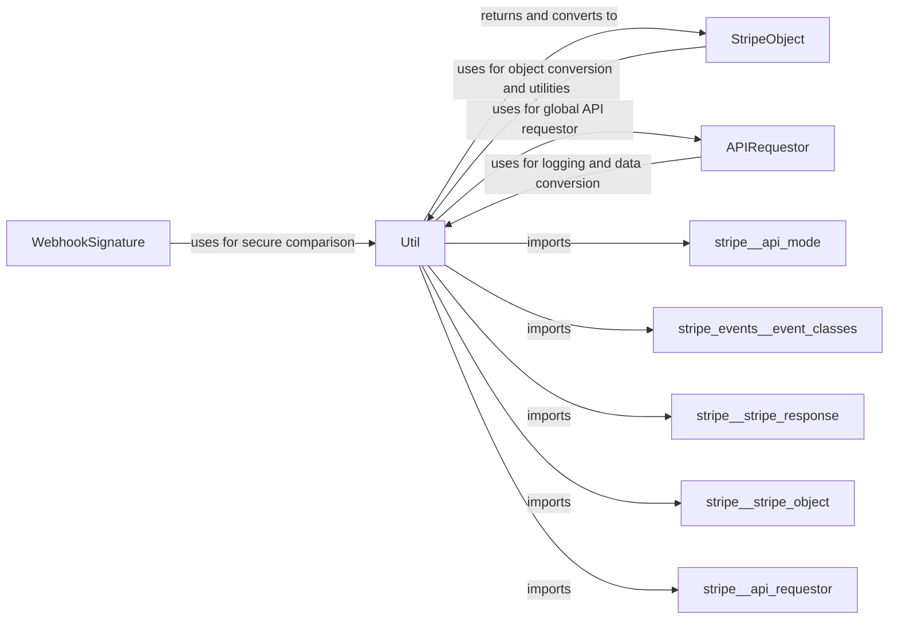

## Component Details

This graph provides an overview of the Core Utilities component within the Stripe Python library. It details the various helper functions and utilities provided by this component, such as logging, data conversion, security utilities, and ID sanitization. The graph illustrates how these utilities support other core components like APIRequestor, StripeObject, and WebhookSignature by providing essential common functionalities, thereby streamlining API interactions and data handling within the library.

### Util
This module provides a collection of essential helper functions and utilities that support various common tasks across the Stripe Python library. Its responsibilities include: Logging, Data Conversion, Security Utilities, ID Sanitization, API Mode Detection, Dynamic Class Loading, Header Population, Dictionary Merging, and a Method Decorator.

**Related Classes/Methods**:

- <a href="https://github.com/stripe/stripe-python/blob/master/stripe/_util.py#L1-L350" target="_blank" rel="noopener noreferrer">`stripe._util` (1:350)</a>
- <a href="https://github.com/stripe/stripe-python/blob/master/stripe/_util.py#L117-L121" target="_blank" rel="noopener noreferrer">`stripe._util.log_debug` (117:121)</a>
- <a href="https://github.com/stripe/stripe-python/blob/master/stripe/_util.py#L124-L128" target="_blank" rel="noopener noreferrer">`stripe._util.log_info` (124:128)</a>
- <a href="https://github.com/stripe/stripe-python/blob/master/stripe/_util.py#L146-L164" target="_blank" rel="noopener noreferrer">`stripe._util.logfmt` (146:164)</a>
- <a href="https://github.com/stripe/stripe-python/blob/master/stripe/_util.py#L97-L115" target="_blank" rel="noopener noreferrer">`stripe._util.secure_compare` (97:115)</a>
- <a href="https://github.com/stripe/stripe-python/blob/master/stripe/_util.py#L217-L226" target="_blank" rel="noopener noreferrer">`stripe._util.convert_to_stripe_object` (217:226)</a>
- <a href="https://github.com/stripe/stripe-python/blob/master/stripe/_util.py#L268-L275" target="_blank" rel="noopener noreferrer">`stripe._util._convert_to_stripe_object` (268:275)</a>
- <a href="https://github.com/stripe/stripe-python/blob/master/stripe/_util.py#L368-L385" target="_blank" rel="noopener noreferrer">`stripe._util.convert_to_dict` (368:385)</a>
- <a href="https://github.com/stripe/stripe-python/blob/master/stripe/_util.py#L415-L417" target="_blank" rel="noopener noreferrer">`stripe._util.sanitize_id` (415:417)</a>
- <a href="https://github.com/stripe/stripe-python/blob/master/stripe/_util.py#L201-L210" target="_blank" rel="noopener noreferrer">`stripe._util.get_object_classes` (201:210)</a>
- <a href="https://github.com/stripe/stripe-python/blob/master/stripe/_util.py#L195-L198" target="_blank" rel="noopener noreferrer">`stripe._util.get_thin_event_classes` (195:198)</a>
- <a href="https://github.com/stripe/stripe-python/blob/master/stripe/_util.py#L389-L391" target="_blank" rel="noopener noreferrer">`stripe._util.populate_headers` (389:391)</a>
- <a href="https://github.com/stripe/stripe-python/blob/master/stripe/_util.py#L409-L412" target="_blank" rel="noopener noreferrer">`stripe._util.merge_dicts` (409:412)</a>
- <a href="https://github.com/stripe/stripe-python/blob/master/stripe/_util.py#L420-L424" target="_blank" rel="noopener noreferrer">`stripe._util.get_api_mode` (420:424)</a>
- <a href="https://github.com/stripe/stripe-python/blob/master/stripe/_util.py#L427-L460" target="_blank" rel="noopener noreferrer">`stripe._util.class_method_variant` (427:460)</a>

### [FAQ](https://github.com/CodeBoarding/GeneratedOnBoardings/tree/main?tab=readme-ov-file#faq)