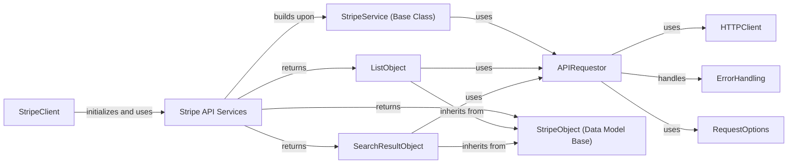

## Component Details

This graph provides an architectural overview of the `Stripe API Services` subsystem, which acts as the primary interface for interacting with various Stripe API resources. It details how individual service classes, built upon a common base, leverage core components like the API requestor and data models to facilitate seamless communication with the Stripe API.

### Stripe API Services
A collection of service classes that provide methods for interacting with specific Stripe API resources (e.g., Customers, Payments, Subscriptions, Issuing, Tax, OAuth, Treasury, Terminal, Test Helpers). These services build upon the API Service Base and return API Data Model objects.

**Related Classes/Methods**:

- <a href="https://github.com/stripe/stripe-python/blob/master/stripe/_oauth_service.py#L13-L99" target="_blank" rel="noopener noreferrer">`stripe._oauth_service.OAuthService` (13:99)</a>
- <a href="https://github.com/stripe/stripe-python/blob/master/stripe/_customer_service.py#L31-L988" target="_blank" rel="noopener noreferrer">`stripe._customer_service.CustomerService` (31:988)</a>
- <a href="https://github.com/stripe/stripe-python/blob/master/stripe/_payment_intent_service.py#L13-L8888" target="_blank" rel="noopener noreferrer">`stripe._payment_intent_service.PaymentIntentService` (13:8888)</a>
- <a href="https://github.com/stripe/stripe-python/blob/master/stripe/_subscription_service.py#L14-L2043" target="_blank" rel="noopener noreferrer">`stripe._subscription_service.SubscriptionService` (14:2043)</a>
- <a href="https://github.com/stripe/stripe-python/blob/master/stripe/_treasury_service.py#L16-L28" target="_blank" rel="noopener noreferrer">`stripe._treasury_service.TreasuryService` (16:28)</a>
- <a href="https://github.com/stripe/stripe-python/blob/master/stripe/_terminal_service.py#L10-L16" target="_blank" rel="noopener noreferrer">`stripe._terminal_service.TerminalService` (10:16)</a>
- <a href="https://github.com/stripe/stripe-python/blob/master/stripe/_issuing_service.py#L16-L28" target="_blank" rel="noopener noreferrer">`stripe._issuing_service.IssuingService` (16:28)</a>
- <a href="https://github.com/stripe/stripe-python/blob/master/stripe/_tax_service.py#L10-L16" target="_blank" rel="noopener noreferrer">`stripe._tax_service.TaxService` (10:16)</a>
- <a href="https://github.com/stripe/stripe-python/blob/master/stripe/_test_helpers_service.py#L15-L24" target="_blank" rel="noopener noreferrer">`stripe._test_helpers_service.TestHelpersService` (15:24)</a>
- <a href="https://github.com/stripe/stripe-python/blob/master/stripe/_list_object.py#L29-L257" target="_blank" rel="noopener noreferrer">`stripe._list_object.ListObject` (29:257)</a>
- <a href="https://github.com/stripe/stripe-python/blob/master/stripe/_search_result_object.py#L27-L178" target="_blank" rel="noopener noreferrer">`stripe._search_result_object.SearchResultObject` (27:178)</a>

### StripeService (Base Class)
The abstract base class for all Stripe API service objects, providing common methods for API interaction and acting as the foundation for specific resource services.

**Related Classes/Methods**:

- <a href="https://github.com/stripe/stripe-python/blob/master/stripe/_stripe_service.py#L15-L91" target="_blank" rel="noopener noreferrer">`stripe._stripe_service.StripeService` (15:91)</a>

### APIRequestor
Responsible for constructing and sending HTTP requests to the Stripe API endpoints, handling request options, API versioning, and processing raw HTTP responses.

**Related Classes/Methods**:

- `stripe._api_requestor.APIRequestor` (full file reference)

### StripeObject (Data Model Base)
The fundamental base class for all Stripe API resource objects, enabling attribute access and serialization.

**Related Classes/Methods**:

- <a href="https://github.com/stripe/stripe-python/blob/master/stripe/_stripe_object.py#L80-L612" target="_blank" rel="noopener noreferrer">`stripe._stripe_object.StripeObject` (80:612)</a>

### ListObject
A specialized Stripe object representing a paginated list of API resources, enabling iteration and fetching of subsequent pages.

**Related Classes/Methods**:

- <a href="https://github.com/stripe/stripe-python/blob/master/stripe/_list_object.py#L29-L257" target="_blank" rel="noopener noreferrer">`stripe._list_object.ListObject` (29:257)</a>

### SearchResultObject
A specialized Stripe object representing a paginated search result of API resources, providing search-specific iteration capabilities.

**Related Classes/Methods**:

- <a href="https://github.com/stripe/stripe-python/blob/master/stripe/_search_result_object.py#L27-L178" target="_blank" rel="noopener noreferrer">`stripe._search_result_object.SearchResultObject` (27:178)</a>

### StripeClient
The central client for interacting with the Stripe API, initializing various service objects and managing API key, version, and HTTP client settings.

**Related Classes/Methods**:

- <a href="https://github.com/stripe/stripe-python/blob/master/stripe/_stripe_client.py#L115-L372" target="_blank" rel="noopener noreferrer">`stripe._stripe_client.StripeClient` (115:372)</a>

### HTTPClient
Provides the low-level HTTP communication layer, responsible for executing HTTP requests and returning raw responses.

**Related Classes/Methods**:

- <a href="https://github.com/stripe/stripe-python/blob/master/stripe/_http_client.py#L144-L590" target="_blank" rel="noopener noreferrer">`stripe._http_client.HTTPClient` (144:590)</a>

### ErrorHandling
Manages and defines various types of errors that can occur during API interactions, providing a structured way to represent and handle exceptions.

**Related Classes/Methods**:

- <a href="https://github.com/stripe/stripe-python/blob/master/stripe/_error.py#L7-L92" target="_blank" rel="noopener noreferrer">`stripe._error.StripeError` (7:92)</a>

### RequestOptions
Encapsulates various options that can be applied to an API request, such as API key, idempotency key, and Stripe account.

**Related Classes/Methods**:

- <a href="https://github.com/stripe/stripe-python/blob/master/stripe/_request_options.py#L6-L14" target="_blank" rel="noopener noreferrer">`stripe._request_options.RequestOptions` (6:14)</a>

### [FAQ](https://github.com/CodeBoarding/GeneratedOnBoardings/tree/main?tab=readme-ov-file#faq)