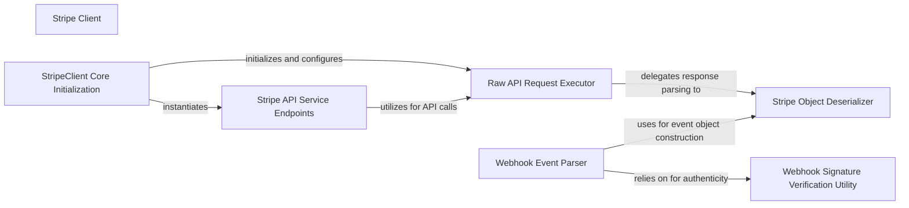

## Component Details

This subsystem provides the core functionality for interacting with the Stripe API, serving as the central client interface. It manages the initialization and configuration of the API client, offers access to a wide range of Stripe API services, handles the execution of raw API requests, and includes utilities for parsing webhook events and deserializing API responses into structured Python objects. Its primary purpose is to abstract the complexities of the Stripe API, offering a user-friendly and robust SDK experience.

### Stripe Client
The primary entry point for users to interact with the Stripe API. It initializes and provides access to various Stripe service clients, acting as the central interface for the SDK. It also handles webhook event construction and raw API requests.

**Related Classes/Methods**:

- <a href="https://github.com/stripe/stripe-python/blob/master/stripe/_stripe_client.py#L115-L372" target="_blank" rel="noopener noreferrer">`stripe._stripe_client.StripeClient` (115:372)</a>

### StripeClient Core Initialization
Manages the initial setup of the Stripe client, including API key validation, configuration of the HTTP client, and the instantiation of the core API requestor and client options. This component ensures the client is properly set up before making any API calls.

**Related Classes/Methods**:

- <a href="https://github.com/stripe/stripe-python/blob/master/stripe/_stripe_client.py#L116-L268" target="_blank" rel="noopener noreferrer">`stripe._stripe_client.StripeClient:__init__` (116:268)</a>
- <a href="https://github.com/stripe/stripe-python/blob/master/stripe/_error.py#L172-L173" target="_blank" rel="noopener noreferrer">`stripe._error.AuthenticationError` (172:173)</a>
- <a href="https://github.com/stripe/stripe-python/blob/master/stripe/_requestor_options.py#L8-L57" target="_blank" rel="noopener noreferrer">`stripe._requestor_options.RequestorOptions` (8:57)</a>
- <a href="https://github.com/stripe/stripe-python/blob/master/stripe/_client_options.py#L4-L17" target="_blank" rel="noopener noreferrer">`stripe._client_options._ClientOptions` (4:17)</a>
- <a href="https://github.com/stripe/stripe-python/blob/master/stripe/_http_client.py#L120-L130" target="_blank" rel="noopener noreferrer">`stripe._http_client.new_default_http_client` (120:130)</a>
- <a href="https://github.com/stripe/stripe-python/blob/master/stripe/_http_client.py#L133-L141" target="_blank" rel="noopener noreferrer">`stripe._http_client.new_http_client_async_fallback` (133:141)</a>
- <a href="https://github.com/stripe/stripe-python/blob/master/stripe/_api_requestor.py#L69-L904" target="_blank" rel="noopener noreferrer">`stripe._api_requestor._APIRequestor` (69:904)</a>

### Stripe API Service Endpoints
A comprehensive collection of specialized service classes, each providing a high-level interface to interact with specific Stripe API resources (e.g., accounts, charges, payments, invoices). These services abstract the underlying API request mechanisms, offering a structured way to access Stripe's functionalities.

**Related Classes/Methods**:

- <a href="https://github.com/stripe/stripe-python/blob/master/stripe/_oauth_service.py#L13-L99" target="_blank" rel="noopener noreferrer">`stripe._oauth_service.OAuthService` (13:99)</a>
- <a href="https://github.com/stripe/stripe-python/blob/master/stripe/_account_service.py#L18-L4083" target="_blank" rel="noopener noreferrer">`stripe._account_service.AccountService` (18:4083)</a>
- <a href="https://github.com/stripe/stripe-python/blob/master/stripe/_account_link_service.py#L10-L89" target="_blank" rel="noopener noreferrer">`stripe._account_link_service.AccountLinkService` (10:89)</a>
- <a href="https://github.com/stripe/stripe-python/blob/master/stripe/_account_session_service.py#L10-L589" target="_blank" rel="noopener noreferrer">`stripe._account_session_service.AccountSessionService` (10:589)</a>
- <a href="https://github.com/stripe/stripe-python/blob/master/stripe/_apple_pay_domain_service.py#L12-L210" target="_blank" rel="noopener noreferrer">`stripe._apple_pay_domain_service.ApplePayDomainService` (12:210)</a>
- <a href="https://github.com/stripe/stripe-python/blob/master/stripe/_application_fee_service.py#L13-L144" target="_blank" rel="noopener noreferrer">`stripe._application_fee_service.ApplicationFeeService` (13:144)</a>
- <a href="https://github.com/stripe/stripe-python/blob/master/stripe/_apps_service.py#L7-L10" target="_blank" rel="noopener noreferrer">`stripe._apps_service.AppsService` (7:10)</a>
- <a href="https://github.com/stripe/stripe-python/blob/master/stripe/_balance_service.py#L10-L55" target="_blank" rel="noopener noreferrer">`stripe._balance_service.BalanceService` (10:55)</a>
- <a href="https://github.com/stripe/stripe-python/blob/master/stripe/_balance_transaction_service.py#L12-L159" target="_blank" rel="noopener noreferrer">`stripe._balance_transaction_service.BalanceTransactionService` (12:159)</a>
- <a href="https://github.com/stripe/stripe-python/blob/master/stripe/_billing_service.py#L19-L34" target="_blank" rel="noopener noreferrer">`stripe._billing_service.BillingService` (19:34)</a>
- <a href="https://github.com/stripe/stripe-python/blob/master/stripe/_billing_portal_service.py#L8-L12" target="_blank" rel="noopener noreferrer">`stripe._billing_portal_service.BillingPortalService` (8:12)</a>
- <a href="https://github.com/stripe/stripe-python/blob/master/stripe/_charge_service.py#L13-L626" target="_blank" rel="noopener noreferrer">`stripe._charge_service.ChargeService` (13:626)</a>
- <a href="https://github.com/stripe/stripe-python/blob/master/stripe/_checkout_service.py#L7-L10" target="_blank" rel="noopener noreferrer">`stripe._checkout_service.CheckoutService` (7:10)</a>
- <a href="https://github.com/stripe/stripe-python/blob/master/stripe/_climate_service.py#L9-L14" target="_blank" rel="noopener noreferrer">`stripe._climate_service.ClimateService` (9:14)</a>
- <a href="https://github.com/stripe/stripe-python/blob/master/stripe/_confirmation_token_service.py#L11-L60" target="_blank" rel="noopener noreferrer">`stripe._confirmation_token_service.ConfirmationTokenService` (11:60)</a>
- <a href="https://github.com/stripe/stripe-python/blob/master/stripe/_test_helpers_service.py#L15-L24" target="_blank" rel="noopener noreferrer">`stripe._test_helpers_service.TestHelpersService` (15:24)</a>
- <a href="https://github.com/stripe/stripe-python/blob/master/stripe/_country_spec_service.py#L12-L117" target="_blank" rel="noopener noreferrer">`stripe._country_spec_service.CountrySpecService` (12:117)</a>
- <a href="https://github.com/stripe/stripe-python/blob/master/stripe/_coupon_service.py#L12-L354" target="_blank" rel="noopener noreferrer">`stripe._coupon_service.CouponService` (12:354)</a>
- <a href="https://github.com/stripe/stripe-python/blob/master/stripe/_credit_note_service.py#L16-L626" target="_blank" rel="noopener noreferrer">`stripe._credit_note_service.CreditNoteService` (16:626)</a>
- <a href="https://github.com/stripe/stripe-python/blob/master/stripe/_customer_service.py#L31-L988" target="_blank" rel="noopener noreferrer">`stripe._customer_service.CustomerService` (31:988)</a>
- <a href="https://github.com/stripe/stripe-python/blob/master/stripe/_customer_session_service.py#L10-L143" target="_blank" rel="noopener noreferrer">`stripe._customer_session_service.CustomerSessionService` (10:143)</a>
- <a href="https://github.com/stripe/stripe-python/blob/master/stripe/_dispute_service.py#L12-L547" target="_blank" rel="noopener noreferrer">`stripe._dispute_service.DisputeService` (12:547)</a>
- <a href="https://github.com/stripe/stripe-python/blob/master/stripe/_entitlements_service.py#L10-L14" target="_blank" rel="noopener noreferrer">`stripe._entitlements_service.EntitlementsService` (10:14)</a>
- <a href="https://github.com/stripe/stripe-python/blob/master/stripe/_ephemeral_key_service.py#L11-L116" target="_blank" rel="noopener noreferrer">`stripe._ephemeral_key_service.EphemeralKeyService` (11:116)</a>
- <a href="https://github.com/stripe/stripe-python/blob/master/stripe/_event_service.py#L12-L147" target="_blank" rel="noopener noreferrer">`stripe._event_service.EventService` (12:147)</a>
- <a href="https://github.com/stripe/stripe-python/blob/master/stripe/_exchange_rate_service.py#L12-L117" target="_blank" rel="noopener noreferrer">`stripe._exchange_rate_service.ExchangeRateService` (12:117)</a>
- <a href="https://github.com/stripe/stripe-python/blob/master/stripe/_file_service.py#L12-L243" target="_blank" rel="noopener noreferrer">`stripe._file_service.FileService` (12:243)</a>
- <a href="https://github.com/stripe/stripe-python/blob/master/stripe/_file_link_service.py#L12-L253" target="_blank" rel="noopener noreferrer">`stripe._file_link_service.FileLinkService` (12:253)</a>
- <a href="https://github.com/stripe/stripe-python/blob/master/stripe/_financial_connections_service.py#L11-L16" target="_blank" rel="noopener noreferrer">`stripe._financial_connections_service.FinancialConnectionsService` (11:16)</a>
- <a href="https://github.com/stripe/stripe-python/blob/master/stripe/_forwarding_service.py#L7-L10" target="_blank" rel="noopener noreferrer">`stripe._forwarding_service.ForwardingService` (7:10)</a>
- <a href="https://github.com/stripe/stripe-python/blob/master/stripe/_identity_service.py#L12-L18" target="_blank" rel="noopener noreferrer">`stripe._identity_service.IdentityService` (12:18)</a>
- <a href="https://github.com/stripe/stripe-python/blob/master/stripe/_invoice_service.py#L14-L3702" target="_blank" rel="noopener noreferrer">`stripe._invoice_service.InvoiceService` (14:3702)</a>
- <a href="https://github.com/stripe/stripe-python/blob/master/stripe/_invoice_payment_service.py#L12-L139" target="_blank" rel="noopener noreferrer">`stripe._invoice_payment_service.InvoicePaymentService` (12:139)</a>
- <a href="https://github.com/stripe/stripe-python/blob/master/stripe/_invoice_rendering_template_service.py#L12-L219" target="_blank" rel="noopener noreferrer">`stripe._invoice_rendering_template_service.InvoiceRenderingTemplateService` (12:219)</a>
- <a href="https://github.com/stripe/stripe-python/blob/master/stripe/_invoice_item_service.py#L12-L528" target="_blank" rel="noopener noreferrer">`stripe._invoice_item_service.InvoiceItemService` (12:528)</a>
- <a href="https://github.com/stripe/stripe-python/blob/master/stripe/_issuing_service.py#L16-L28" target="_blank" rel="noopener noreferrer">`stripe._issuing_service.IssuingService` (16:28)</a>
- <a href="https://github.com/stripe/stripe-python/blob/master/stripe/_mandate_service.py#L11-L56" target="_blank" rel="noopener noreferrer">`stripe._mandate_service.MandateService` (11:56)</a>
- <a href="https://github.com/stripe/stripe-python/blob/master/stripe/_payment_intent_service.py#L13-L8888" target="_blank" rel="noopener noreferrer">`stripe._payment_intent_service.PaymentIntentService` (13:8888)</a>
- <a href="https://github.com/stripe/stripe-python/blob/master/stripe/_payment_link_service.py#L13-L1947" target="_blank" rel="noopener noreferrer">`stripe._payment_link_service.PaymentLinkService` (13:1947)</a>
- <a href="https://github.com/stripe/stripe-python/blob/master/stripe/_payment_method_service.py#L12-L1253" target="_blank" rel="noopener noreferrer">`stripe._payment_method_service.PaymentMethodService` (12:1253)</a>
- <a href="https://github.com/stripe/stripe-python/blob/master/stripe/_payment_method_configuration_service.py#L12-L2267" target="_blank" rel="noopener noreferrer">`stripe._payment_method_configuration_service.PaymentMethodConfigurationService` (12:2267)</a>
- <a href="https://github.com/stripe/stripe-python/blob/master/stripe/_payment_method_domain_service.py#L12-L291" target="_blank" rel="noopener noreferrer">`stripe._payment_method_domain_service.PaymentMethodDomainService` (12:291)</a>
- <a href="https://github.com/stripe/stripe-python/blob/master/stripe/_payout_service.py#L12-L407" target="_blank" rel="noopener noreferrer">`stripe._payout_service.PayoutService` (12:407)</a>
- <a href="https://github.com/stripe/stripe-python/blob/master/stripe/_plan_service.py#L12-L421" target="_blank" rel="noopener noreferrer">`stripe._plan_service.PlanService` (12:421)</a>
- <a href="https://github.com/stripe/stripe-python/blob/master/stripe/_price_service.py#L13-L670" target="_blank" rel="noopener noreferrer">`stripe._price_service.PriceService` (13:670)</a>
- <a href="https://github.com/stripe/stripe-python/blob/master/stripe/_product_service.py#L14-L677" target="_blank" rel="noopener noreferrer">`stripe._product_service.ProductService` (14:677)</a>
- <a href="https://github.com/stripe/stripe-python/blob/master/stripe/_promotion_code_service.py#L12-L345" target="_blank" rel="noopener noreferrer">`stripe._promotion_code_service.PromotionCodeService` (12:345)</a>
- <a href="https://github.com/stripe/stripe-python/blob/master/stripe/_quote_service.py#L16-L930" target="_blank" rel="noopener noreferrer">`stripe._quote_service.QuoteService` (16:930)</a>
- <a href="https://github.com/stripe/stripe-python/blob/master/stripe/_radar_service.py#L9-L14" target="_blank" rel="noopener noreferrer">`stripe._radar_service.RadarService` (9:14)</a>
- <a href="https://github.com/stripe/stripe-python/blob/master/stripe/_refund_service.py#L12-L360" target="_blank" rel="noopener noreferrer">`stripe._refund_service.RefundService` (12:360)</a>
- <a href="https://github.com/stripe/stripe-python/blob/master/stripe/_reporting_service.py#L8-L12" target="_blank" rel="noopener noreferrer">`stripe._reporting_service.ReportingService` (8:12)</a>
- <a href="https://github.com/stripe/stripe-python/blob/master/stripe/_review_service.py#L12-L185" target="_blank" rel="noopener noreferrer">`stripe._review_service.ReviewService` (12:185)</a>
- <a href="https://github.com/stripe/stripe-python/blob/master/stripe/_sigma_service.py#L7-L10" target="_blank" rel="noopener noreferrer">`stripe._sigma_service.SigmaService` (7:10)</a>
- <a href="https://github.com/stripe/stripe-python/blob/master/stripe/_setup_attempt_service.py#L11-L95" target="_blank" rel="noopener noreferrer">`stripe._setup_attempt_service.SetupAttemptService` (11:95)</a>
- <a href="https://github.com/stripe/stripe-python/blob/master/stripe/_setup_intent_service.py#L12-L4203" target="_blank" rel="noopener noreferrer">`stripe._setup_intent_service.SetupIntentService` (12:4203)</a>
- <a href="https://github.com/stripe/stripe-python/blob/master/stripe/_shipping_rate_service.py#L12-L383" target="_blank" rel="noopener noreferrer">`stripe._shipping_rate_service.ShippingRateService` (12:383)</a>
- <a href="https://github.com/stripe/stripe-python/blob/master/stripe/_source_service.py#L15-L752" target="_blank" rel="noopener noreferrer">`stripe._source_service.SourceService` (15:752)</a>
- <a href="https://github.com/stripe/stripe-python/blob/master/stripe/_subscription_service.py#L14-L2043" target="_blank" rel="noopener noreferrer">`stripe._subscription_service.SubscriptionService` (14:2043)</a>
- <a href="https://github.com/stripe/stripe-python/blob/master/stripe/_subscription_item_service.py#L12-L517" target="_blank" rel="noopener noreferrer">`stripe._subscription_item_service.SubscriptionItemService` (12:517)</a>
- <a href="https://github.com/stripe/stripe-python/blob/master/stripe/_subscription_schedule_service.py#L12-L1429" target="_blank" rel="noopener noreferrer">`stripe._subscription_schedule_service.SubscriptionScheduleService` (12:1429)</a>
- <a href="https://github.com/stripe/stripe-python/blob/master/stripe/_tax_service.py#L10-L16" target="_blank" rel="noopener noreferrer">`stripe._tax_service.TaxService` (10:16)</a>
- <a href="https://github.com/stripe/stripe-python/blob/master/stripe/_tax_code_service.py#L12-L113" target="_blank" rel="noopener noreferrer">`stripe._tax_code_service.TaxCodeService` (12:113)</a>
- <a href="https://github.com/stripe/stripe-python/blob/master/stripe/_tax_id_service.py#L12-L351" target="_blank" rel="noopener noreferrer">`stripe._tax_id_service.TaxIdService` (12:351)</a>
- <a href="https://github.com/stripe/stripe-python/blob/master/stripe/_tax_rate_service.py#L12-L347" target="_blank" rel="noopener noreferrer">`stripe._tax_rate_service.TaxRateService` (12:347)</a>
- <a href="https://github.com/stripe/stripe-python/blob/master/stripe/_terminal_service.py#L10-L16" target="_blank" rel="noopener noreferrer">`stripe._terminal_service.TerminalService` (10:16)</a>
- <a href="https://github.com/stripe/stripe-python/blob/master/stripe/_token_service.py#L11-L1256" target="_blank" rel="noopener noreferrer">`stripe._token_service.TokenService` (11:1256)</a>
- <a href="https://github.com/stripe/stripe-python/blob/master/stripe/_topup_service.py#L12-L331" target="_blank" rel="noopener noreferrer">`stripe._topup_service.TopupService` (12:331)</a>
- <a href="https://github.com/stripe/stripe-python/blob/master/stripe/_transfer_service.py#L13-L290" target="_blank" rel="noopener noreferrer">`stripe._transfer_service.TransferService` (13:290)</a>
- <a href="https://github.com/stripe/stripe-python/blob/master/stripe/_treasury_service.py#L16-L28" target="_blank" rel="noopener noreferrer">`stripe._treasury_service.TreasuryService` (16:28)</a>
- <a href="https://github.com/stripe/stripe-python/blob/master/stripe/_webhook_endpoint_service.py#L12-L923" target="_blank" rel="noopener noreferrer">`stripe._webhook_endpoint_service.WebhookEndpointService` (12:923)</a>
- <a href="https://github.com/stripe/stripe-python/blob/master/stripe/_v2_services.py#L8-L12" target="_blank" rel="noopener noreferrer">`stripe._v2_services.V2Services` (8:12)</a>

### Raw API Request Executor
This component is responsible for the direct execution of synchronous and asynchronous API requests to Stripe. It handles request parameter processing, API mode determination, and the initial interpretation of raw HTTP responses before further deserialization.

**Related Classes/Methods**:

- <a href="https://github.com/stripe/stripe-python/blob/master/stripe/_stripe_client.py#L309-L338" target="_blank" rel="noopener noreferrer">`stripe._stripe_client.StripeClient:raw_request` (309:338)</a>
- <a href="https://github.com/stripe/stripe-python/blob/master/stripe/_stripe_client.py#L340-L358" target="_blank" rel="noopener noreferrer">`stripe._stripe_client.StripeClient:raw_request_async` (340:358)</a>
- <a href="https://github.com/stripe/stripe-python/blob/master/stripe/_request_options.py#L54-L78" target="_blank" rel="noopener noreferrer">`stripe._request_options.extract_options_from_dict` (54:78)</a>
- <a href="https://github.com/stripe/stripe-python/blob/master/stripe/_util.py#L420-L424" target="_blank" rel="noopener noreferrer">`stripe._util.get_api_mode` (420:424)</a>
- <a href="https://github.com/stripe/stripe-python/blob/master/stripe/_api_requestor.py#L665-L738" target="_blank" rel="noopener noreferrer">`stripe._api_requestor._APIRequestor.request_raw` (665:738)</a>
- <a href="https://github.com/stripe/stripe-python/blob/master/stripe/_api_requestor.py#L740-L822" target="_blank" rel="noopener noreferrer">`stripe._api_requestor._APIRequestor.request_raw_async` (740:822)</a>
- <a href="https://github.com/stripe/stripe-python/blob/master/stripe/_api_requestor.py#L827-L856" target="_blank" rel="noopener noreferrer">`stripe._api_requestor._APIRequestor._interpret_response` (827:856)</a>

### Webhook Event Parser
This component provides the functionality to parse and construct Stripe webhook event objects from raw payloads. It works in conjunction with the signature verification utility to ensure event authenticity and provides structured event data.

**Related Classes/Methods**:

- <a href="https://github.com/stripe/stripe-python/blob/master/stripe/_stripe_client.py#L271-L286" target="_blank" rel="noopener noreferrer">`stripe._stripe_client.StripeClient:parse_thin_event` (271:286)</a>
- <a href="https://github.com/stripe/stripe-python/blob/master/stripe/_stripe_client.py#L288-L307" target="_blank" rel="noopener noreferrer">`stripe._stripe_client.StripeClient:construct_event` (288:307)</a>
- <a href="https://github.com/stripe/stripe-python/blob/master/stripe/v2/_event.py#L103-L151" target="_blank" rel="noopener noreferrer">`stripe.v2._event.ThinEvent` (103:151)</a>
- <a href="https://github.com/stripe/stripe-python/blob/master/stripe/_stripe_object.py#L266-L285" target="_blank" rel="noopener noreferrer">`stripe._stripe_object.StripeObject._construct_from` (266:285)</a>

### Stripe Object Deserializer
This component is dedicated to converting raw API responses, typically in JSON format, into structured Python objects that represent Stripe resources. It facilitates easy access and manipulation of API response data within the client library.

**Related Classes/Methods**:

- <a href="https://github.com/stripe/stripe-python/blob/master/stripe/_stripe_client.py#L360-L372" target="_blank" rel="noopener noreferrer">`stripe._stripe_client.StripeClient:deserialize` (360:372)</a>
- <a href="https://github.com/stripe/stripe-python/blob/master/stripe/_util.py#L268-L275" target="_blank" rel="noopener noreferrer">`stripe._util._convert_to_stripe_object` (268:275)</a>

### Webhook Signature Verification Utility
A utility component specifically designed for verifying the cryptographic signature of incoming Stripe webhook events. It ensures the integrity and authenticity of webhook payloads by comparing their signature against a provided secret.

**Related Classes/Methods**:

- <a href="https://github.com/stripe/stripe-python/blob/master/stripe/_webhook.py#L59-L96" target="_blank" rel="noopener noreferrer">`stripe._webhook.WebhookSignature.verify_header` (59:96)</a>

### [FAQ](https://github.com/CodeBoarding/GeneratedOnBoardings/tree/main?tab=readme-ov-file#faq)