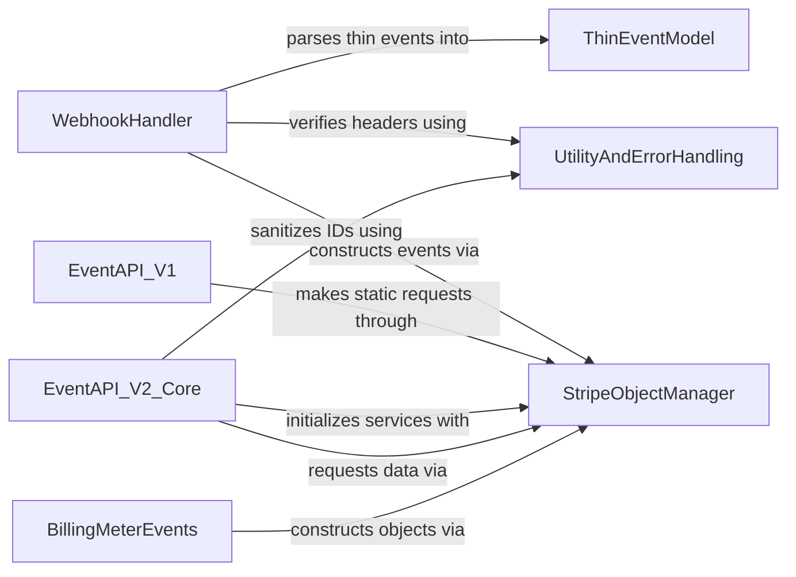

## Component Details

The Webhook & Event Processing subsystem in Stripe's Python client library is responsible for securely handling incoming webhook events and providing interfaces for interacting with Stripe's event APIs (both V1 and V2). It ensures the authenticity of webhook payloads through signature verification, constructs appropriate event objects, and allows for the retrieval and listing of event data from Stripe's API. The system leverages a core object management component for data serialization and API interactions, and includes specialized handling for different event types and API versions.

### WebhookHandler
This component is responsible for processing incoming webhooks, including verifying their signatures and constructing event objects from the payload. It handles both standard and 'thin' event parsing.

**Related Classes/Methods**:

- <a href="https://github.com/stripe/stripe-python/blob/master/stripe/_webhook.py#L19-L36" target="_blank" rel="noopener noreferrer">`stripe._webhook.Webhook:construct_event` (19:36)</a>
- <a href="https://github.com/stripe/stripe-python/blob/master/stripe/_webhook.py#L59-L96" target="_blank" rel="noopener noreferrer">`stripe._webhook.WebhookSignature:verify_header` (59:96)</a>
- <a href="https://github.com/stripe/stripe-python/blob/master/stripe/_webhook.py#L52-L56" target="_blank" rel="noopener noreferrer">`stripe._webhook.WebhookSignature._get_timestamp_and_signatures` (52:56)</a>
- <a href="https://github.com/stripe/stripe-python/blob/master/stripe/_webhook.py#L43-L49" target="_blank" rel="noopener noreferrer">`stripe._webhook.WebhookSignature._compute_signature` (43:49)</a>
- <a href="https://github.com/stripe/stripe-python/blob/master/stripe/_stripe_client.py#L271-L286" target="_blank" rel="noopener noreferrer">`stripe._stripe_client.StripeClient:parse_thin_event` (271:286)</a>
- <a href="https://github.com/stripe/stripe-python/blob/master/stripe/_stripe_client.py#L288-L307" target="_blank" rel="noopener noreferrer">`stripe._stripe_client.StripeClient:construct_event` (288:307)</a>

### EventAPI_V1
This component provides an interface for interacting with Stripe events using the V1 API, allowing for listing and retrieving event objects, both synchronously and asynchronously.

**Related Classes/Methods**:

- <a href="https://github.com/stripe/stripe-python/blob/master/stripe/_event.py#L417-L432" target="_blank" rel="noopener noreferrer">`stripe._event.Event:list` (417:432)</a>
- <a href="https://github.com/stripe/stripe-python/blob/master/stripe/_event.py#L435-L452" target="_blank" rel="noopener noreferrer">`stripe._event.Event:list_async` (435:452)</a>
- <a href="https://github.com/stripe/stripe-python/blob/master/stripe/_event.py#L455-L463" target="_blank" rel="noopener noreferrer">`stripe._event.Event:retrieve` (455:463)</a>
- <a href="https://github.com/stripe/stripe-python/blob/master/stripe/_event.py#L466-L474" target="_blank" rel="noopener noreferrer">`stripe._event.Event:retrieve_async` (466:474)</a>

### EventAPI_V2_Core
This component represents the core service for managing events and event destinations within the V2 Stripe API. It provides methods for listing and retrieving events specific to the V2 API.

**Related Classes/Methods**:

- <a href="https://github.com/stripe/stripe-python/blob/master/stripe/v2/_core_service.py#L9-L12" target="_blank" rel="noopener noreferrer">`stripe.v2._core_service.CoreService:__init__` (9:12)</a>
- <a href="https://github.com/stripe/stripe-python/blob/master/stripe/v2/core/_event_service.py#L26-L41" target="_blank" rel="noopener noreferrer">`stripe.v2.core._event_service.EventService:list` (26:41)</a>
- <a href="https://github.com/stripe/stripe-python/blob/master/stripe/v2/core/_event_service.py#L43-L58" target="_blank" rel="noopener noreferrer">`stripe.v2.core._event_service.EventService:list_async` (43:58)</a>
- <a href="https://github.com/stripe/stripe-python/blob/master/stripe/v2/core/_event_service.py#L60-L78" target="_blank" rel="noopener noreferrer">`stripe.v2.core._event_service.EventService:retrieve` (60:78)</a>
- <a href="https://github.com/stripe/stripe-python/blob/master/stripe/v2/core/_event_service.py#L80-L98" target="_blank" rel="noopener noreferrer">`stripe.v2.core._event_service.EventService:retrieve_async` (80:98)</a>
- <a href="https://github.com/stripe/stripe-python/blob/master/stripe/v2/core/_event_destination_service.py#L13-L474" target="_blank" rel="noopener noreferrer">`stripe.v2.core._event_destination_service.EventDestinationService` (13:474)</a>
- <a href="https://github.com/stripe/stripe-python/blob/master/stripe/v2/core/_event_service.py#L12-L98" target="_blank" rel="noopener noreferrer">`stripe.v2.core._event_service.EventService` (12:98)</a>

### StripeObjectManager
This fundamental component handles the creation, manipulation, and serialization of generic Stripe objects. It also provides core functionalities for making API requests and managing API options.

**Related Classes/Methods**:

- <a href="https://github.com/stripe/stripe-python/blob/master/stripe/_stripe_object.py#L266-L285" target="_blank" rel="noopener noreferrer">`stripe._stripe_object.StripeObject._construct_from` (266:285)</a>
- <a href="https://github.com/stripe/stripe-python/blob/master/stripe/_api_requestor.py#L161-L164" target="_blank" rel="noopener noreferrer">`stripe._api_requestor._APIRequestor._global_with_options` (161:164)</a>
- <a href="https://github.com/stripe/stripe-python/blob/master/stripe/_api_resource.py#L163-L178" target="_blank" rel="noopener noreferrer">`stripe._api_resource.APIResource._static_request` (163:178)</a>
- <a href="https://github.com/stripe/stripe-python/blob/master/stripe/_api_resource.py#L46-L55" target="_blank" rel="noopener noreferrer">`stripe._api_resource.APIResource.class_url` (46:55)</a>
- <a href="https://github.com/stripe/stripe-python/blob/master/stripe/_api_resource.py#L181-L196" target="_blank" rel="noopener noreferrer">`stripe._api_resource.APIResource._static_request_async` (181:196)</a>
- <a href="https://github.com/stripe/stripe-python/blob/master/stripe/_api_resource.py#L37-L38" target="_blank" rel="noopener noreferrer">`stripe._api_resource.APIResource.refresh` (37:38)</a>
- <a href="https://github.com/stripe/stripe-python/blob/master/stripe/_api_resource.py#L40-L43" target="_blank" rel="noopener noreferrer">`stripe._api_resource.APIResource.refresh_async` (40:43)</a>
- <a href="https://github.com/stripe/stripe-python/blob/master/stripe/_stripe_service.py#L18-L19" target="_blank" rel="noopener noreferrer">`stripe._stripe_service.StripeService.__init__` (18:19)</a>
- <a href="https://github.com/stripe/stripe-python/blob/master/stripe/_stripe_service.py#L21-L37" target="_blank" rel="noopener noreferrer">`stripe._stripe_service.StripeService._request` (21:37)</a>
- <a href="https://github.com/stripe/stripe-python/blob/master/stripe/_stripe_service.py#L39-L55" target="_blank" rel="noopener noreferrer">`stripe._stripe_service.StripeService._request_async` (39:55)</a>

### UtilityAndErrorHandling
This component provides common utility functions, such as secure comparisons and ID sanitization, and defines custom error types for specific scenarios like signature verification failures.

**Related Classes/Methods**:

- <a href="https://github.com/stripe/stripe-python/blob/master/stripe/_error.py#L184-L187" target="_blank" rel="noopener noreferrer">`stripe._error.SignatureVerificationError` (184:187)</a>
- <a href="https://github.com/stripe/stripe-python/blob/master/stripe/_util.py#L90-L105" target="_blank" rel="noopener noreferrer">`stripe._util.secure_compare` (90:105)</a>
- <a href="https://github.com/stripe/stripe-python/blob/master/stripe/_util.py#L415-L417" target="_blank" rel="noopener noreferrer">`stripe._util.sanitize_id` (415:417)</a>

### BillingMeterEvents
This component specifically deals with the construction of event objects related to billing meter error reports and no meter found scenarios, leveraging the generic Stripe object construction mechanism.

**Related Classes/Methods**:

- <a href="https://github.com/stripe/stripe-python/blob/master/stripe/events/_v1_billing_meter_error_report_triggered_event.py#L95-L116" target="_blank" rel="noopener noreferrer">`stripe.events._v1_billing_meter_error_report_triggered_event.V1BillingMeterErrorReportTriggeredEvent:_construct_from` (95:116)</a>
- <a href="https://github.com/stripe/stripe-python/blob/master/stripe/events/_v1_billing_meter_no_meter_found_event.py#L94-L115" target="_blank" rel="noopener noreferrer">`stripe.events._v1_billing_meter_no_meter_found_event.V1BillingMeterNoMeterFoundEvent:_construct_from` (94:115)</a>

### ThinEventModel
This component defines the data model for a 'thin' event, including its initialization and the structure of related objects and reasons, likely used for a simplified event representation in V2.

**Related Classes/Methods**:

- <a href="https://github.com/stripe/stripe-python/blob/master/stripe/v2/_event.py#L137-L148" target="_blank" rel="noopener noreferrer">`stripe.v2._event.ThinEvent:__init__` (137:148)</a>
- <a href="https://github.com/stripe/stripe-python/blob/master/stripe/v2/_event.py#L103-L151" target="_blank" rel="noopener noreferrer">`stripe.v2._event.ThinEvent` (103:151)</a>
- <a href="https://github.com/stripe/stripe-python/blob/master/stripe/v2/_event.py#L89-L100" target="_blank" rel="noopener noreferrer">`stripe.v2._event.RelatedObject` (89:100)</a>
- <a href="https://github.com/stripe/stripe-python/blob/master/stripe/v2/_event.py#L77-L86" target="_blank" rel="noopener noreferrer">`stripe.v2._event.Reason` (77:86)</a>

### [FAQ](https://github.com/CodeBoarding/GeneratedOnBoardings/tree/main?tab=readme-ov-file#faq)