```mermaid
graph LR
    Stripe_Client["Stripe Client"]
    API_Request_Transport["API Request & Transport"]
    API_Data_Model["API Data Model"]
    API_Service_Base["API Service Base"]
    API_Error_Handling["API Error Handling"]
    Core_Utilities["Core Utilities"]
    Webhook_Event_Processing["Webhook & Event Processing"]
    Stripe_API_Services["Stripe API Services"]
    Stripe_Client -- "initializes" --> API_Request_Transport
    Stripe_Client -- "initializes" --> Stripe_API_Services
    Stripe_Client -- "initializes" --> Webhook_Event_Processing
    Stripe_Client -- "uses" --> Core_Utilities
    Stripe_Client -- "uses" --> API_Error_Handling
    API_Request_Transport -- "uses" --> Core_Utilities
    API_Request_Transport -- "raises" --> API_Error_Handling
    API_Request_Transport -- "provides data to" --> API_Data_Model
    API_Data_Model -- "uses" --> API_Request_Transport
    API_Data_Model -- "uses" --> Core_Utilities
    API_Data_Model -- "uses" --> API_Error_Handling
    API_Service_Base -- "uses" --> API_Request_Transport
    API_Service_Base -- "uses" --> API_Data_Model
    Core_Utilities -- "is used by" --> Stripe_Client
    Core_Utilities -- "is used by" --> API_Request_Transport
    Core_Utilities -- "is used by" --> API_Data_Model
    Core_Utilities -- "is used by" --> Webhook_Event_Processing
    Webhook_Event_Processing -- "uses" --> Core_Utilities
    Webhook_Event_Processing -- "uses" --> API_Data_Model
    Stripe_API_Services -- "inherits from" --> API_Service_Base
    Stripe_API_Services -- "uses" --> API_Data_Model
    click Stripe_Client href "https://github.com/CodeBoarding/GeneratedOnBoardings/blob/main/stripe-python/Stripe Client.md" "Details"
    click API_Request_Transport href "https://github.com/CodeBoarding/GeneratedOnBoardings/blob/main/stripe-python/API Request & Transport.md" "Details"
    click API_Data_Model href "https://github.com/CodeBoarding/GeneratedOnBoardings/blob/main/stripe-python/API Data Model.md" "Details"
    click API_Service_Base href "https://github.com/CodeBoarding/GeneratedOnBoardings/blob/main/stripe-python/API Service Base.md" "Details"
    click API_Error_Handling href "https://github.com/CodeBoarding/GeneratedOnBoardings/blob/main/stripe-python/API Error Handling.md" "Details"
    click Core_Utilities href "https://github.com/CodeBoarding/GeneratedOnBoardings/blob/main/stripe-python/Core Utilities.md" "Details"
    click Webhook_Event_Processing href "https://github.com/CodeBoarding/GeneratedOnBoardings/blob/main/stripe-python/Webhook & Event Processing.md" "Details"
    click Stripe_API_Services href "https://github.com/CodeBoarding/GeneratedOnBoardings/blob/main/stripe-python/Stripe API Services.md" "Details"
```

## Component Details

The `stripe-python` library provides a comprehensive interface for interacting with the Stripe API. The core functionality revolves around the `Stripe Client` which acts as the main entry point, orchestrating API requests through the `API Request & Transport` layer. Data received from the API is modeled and managed by the `API Data Model` component. Specific API functionalities are encapsulated within `Stripe API Services`, which inherit from a common `API Service Base`. Error conditions are handled by the `API Error Handling` component, and various common tasks are supported by `Core Utilities`. Additionally, the library includes dedicated components for `Webhook & Event Processing` to handle incoming Stripe events.

### Stripe Client
The primary entry point for users to interact with the Stripe API. It initializes and provides access to various Stripe service clients, acting as the central interface for the SDK. It also handles webhook event construction and raw API requests.

**Related Classes/Methods**:

- <a href="https://github.com/stripe/stripe-python/blob/master/stripe/_stripe_client.py#L115-L372" target="_blank" rel="noopener noreferrer">`stripe._stripe_client.StripeClient` (115:372)</a>

### API Request & Transport
Manages the entire lifecycle of API requests, including constructing request headers, handling retries, and delegating to the underlying HTTP client for actual network communication. It also interprets raw responses and handles error propagation.

**Related Classes/Methods**:

- <a href="https://github.com/stripe/stripe-python/blob/master/stripe/_api_requestor.py#L69-L904" target="_blank" rel="noopener noreferrer">`stripe._api_requestor._APIRequestor` (69:904)</a>
- <a href="https://github.com/stripe/stripe-python/blob/master/stripe/_http_client.py#L144-L590" target="_blank" rel="noopener noreferrer">`stripe._http_client.HTTPClient` (144:590)</a>
- <a href="https://github.com/stripe/stripe-python/blob/master/stripe/_http_client.py#L593-L776" target="_blank" rel="noopener noreferrer">`stripe._http_client.RequestsClient` (593:776)</a>
- <a href="https://github.com/stripe/stripe-python/blob/master/stripe/_http_client.py#L1219-L1381" target="_blank" rel="noopener noreferrer">`stripe._http_client.HTTPXClient` (1219:1381)</a>
- <a href="https://github.com/stripe/stripe-python/blob/master/stripe/_http_client.py#L1384-L1497" target="_blank" rel="noopener noreferrer">`stripe._http_client.AIOHTTPClient` (1384:1497)</a>

### API Data Model
Defines the foundational classes for representing Stripe API resources and objects. It handles object construction from API responses, attribute access, serialization/deserialization, and provides methods for refreshing object data.

**Related Classes/Methods**:

- <a href="https://github.com/stripe/stripe-python/blob/master/stripe/_stripe_object.py#L80-L612" target="_blank" rel="noopener noreferrer">`stripe._stripe_object.StripeObject` (80:612)</a>
- <a href="https://github.com/stripe/stripe-python/blob/master/stripe/_api_resource.py#L25-L232" target="_blank" rel="noopener noreferrer">`stripe._api_resource.APIResource` (25:232)</a>

### API Service Base
A foundational class for all specific Stripe API services. It provides common methods for making API requests (e.g., _request, _request_async) by delegating to the API Request & Transport component.

**Related Classes/Methods**:

- <a href="https://github.com/stripe/stripe-python/blob/master/stripe/_stripe_service.py#L15-L91" target="_blank" rel="noopener noreferrer">`stripe._stripe_service.StripeService` (15:91)</a>

### API Error Handling
Defines a hierarchy of custom exception classes for various API errors (e.g., connection errors, card errors, invalid requests), providing structured error information to the user.

**Related Classes/Methods**:

- <a href="https://github.com/stripe/stripe-python/blob/master/stripe/_error.py#L7-L92" target="_blank" rel="noopener noreferrer">`stripe._error.StripeError` (7:92)</a>
- <a href="https://github.com/stripe/stripe-python/blob/master/stripe/_error.py#L95-L96" target="_blank" rel="noopener noreferrer">`stripe._error.APIError` (95:96)</a>
- <a href="https://github.com/stripe/stripe-python/blob/master/stripe/_error.py#L99-L115" target="_blank" rel="noopener noreferrer">`stripe._error.APIConnectionError` (99:115)</a>
- <a href="https://github.com/stripe/stripe-python/blob/master/stripe/_error.py#L134-L148" target="_blank" rel="noopener noreferrer">`stripe._error.CardError` (134:148)</a>
- <a href="https://github.com/stripe/stripe-python/blob/master/stripe/_error.py#L155-L169" target="_blank" rel="noopener noreferrer">`stripe._error.InvalidRequestError` (155:169)</a>
- <a href="https://github.com/stripe/stripe-python/blob/master/stripe/_error.py#L172-L173" target="_blank" rel="noopener noreferrer">`stripe._error.AuthenticationError` (172:173)</a>
- <a href="https://github.com/stripe/stripe-python/blob/master/stripe/_error.py#L184-L187" target="_blank" rel="noopener noreferrer">`stripe._error.SignatureVerificationError` (184:187)</a>
- <a href="https://github.com/stripe/stripe-python/blob/master/stripe/oauth_error.py#L6-L28" target="_blank" rel="noopener noreferrer">`stripe.oauth_error.OAuthError` (6:28)</a>

### Core Utilities
Provides various helper functions for common tasks such as logging, ID sanitization, data type conversions, secure comparisons, and converting raw API responses into Stripe objects.

**Related Classes/Methods**:

- <a href="https://github.com/stripe/stripe-python/blob/master/stripe/_util.py#L1-L350" target="_blank" rel="noopener noreferrer">`stripe._util` (1:350)</a>

### Webhook & Event Processing
Provides utilities for constructing and verifying Stripe webhook events, ensuring the authenticity and integrity of incoming event data.

**Related Classes/Methods**:

- <a href="https://github.com/stripe/stripe-python/blob/master/stripe/_webhook.py#L15-L36" target="_blank" rel="noopener noreferrer">`stripe._webhook.Webhook` (15:36)</a>
- <a href="https://github.com/stripe/stripe-python/blob/master/stripe/_webhook.py#L39-L96" target="_blank" rel="noopener noreferrer">`stripe._webhook.WebhookSignature` (39:96)</a>
- <a href="https://github.com/stripe/stripe-python/blob/master/stripe/_event.py#L11-L476" target="_blank" rel="noopener noreferrer">`stripe._event.Event` (11:476)</a>
- <a href="https://github.com/stripe/stripe-python/blob/master/stripe/v2/_event.py#L103-L151" target="_blank" rel="noopener noreferrer">`stripe.v2._event.ThinEvent` (103:151)</a>

### Stripe API Services
A collection of service classes that provide methods for interacting with specific Stripe API resources (e.g., Customers, Payments, Subscriptions, Issuing, Tax, OAuth, Treasury, Terminal, Test Helpers). These services build upon the API Service Base and return API Data Model objects.

**Related Classes/Methods**:

- <a href="https://github.com/stripe/stripe-python/blob/master/stripe/_oauth_service.py#L13-L99" target="_blank" rel="noopener noreferrer">`stripe._oauth_service.OAuthService` (13:99)</a>
- <a href="https://github.com/stripe/stripe-python/blob/master/stripe/_customer_service.py#L31-L988" target="_blank" rel="noopener noreferrer">`stripe._customer_service.CustomerService` (31:988)</a>
- <a href="https://github.com/stripe/stripe-python/blob/master/stripe/_payment_intent_service.py#L13-L8888" target="_blank" rel="noopener noreferrer">`stripe._payment_intent_service.PaymentIntentService` (13:8888)</a>
- <a href="https://github.com/stripe/stripe-python/blob/master/stripe/_subscription_service.py#L14-L2043" target="_blank" rel="noopener noreferrer">`stripe._subscription_service.SubscriptionService` (14:2043)</a>
- <a href="https://github.com/stripe/stripe-python/blob/master/stripe/_treasury_service.py#L16-L28" target="_blank" rel="noopener noreferrer">`stripe._treasury_service.TreasuryService` (16:28)</a>
- <a href="https://github.com/stripe/stripe-python/blob/master/stripe/_terminal_service.py#L10-L16" target="_blank" rel="noopener noreferrer">`stripe._terminal_service.TerminalService` (10:16)</a>
- <a href="https://github.com/stripe/stripe-python/blob/master/stripe/_issuing_service.py#L16-L28" target="_blank" rel="noopener noreferrer">`stripe._issuing_service.IssuingService` (16:28)</a>
- <a href="https://github.com/stripe/stripe-python/blob/master/stripe/_tax_service.py#L10-L16" target="_blank" rel="noopener noreferrer">`stripe._tax_service.TaxService` (10:16)</a>
- <a href="https://github.com/stripe/stripe-python/blob/master/stripe/_test_helpers_service.py#L15-L24" target="_blank" rel="noopener noreferrer">`stripe._test_helpers_service.TestHelpersService` (15:24)</a>
- <a href="https://github.com/stripe/stripe-python/blob/master/stripe/_list_object.py#L29-L257" target="_blank" rel="noopener noreferrer">`stripe._list_object.ListObject` (29:257)</a>
- <a href="https://github.com/stripe/stripe-python/blob/master/stripe/_search_result_object.py#L27-L178" target="_blank" rel="noopener noreferrer">`stripe._search_result_object.SearchResultObject` (27:178)</a>

### [FAQ](https://github.com/CodeBoarding/GeneratedOnBoardings/tree/main?tab=readme-ov-file#faq)